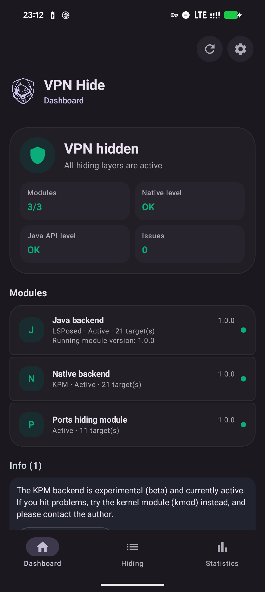
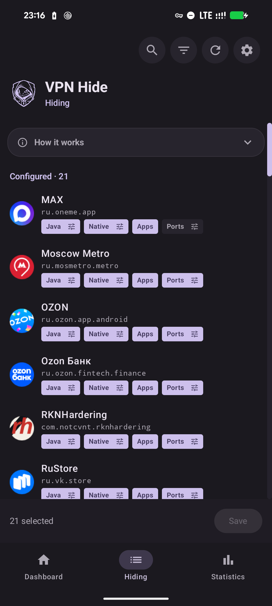
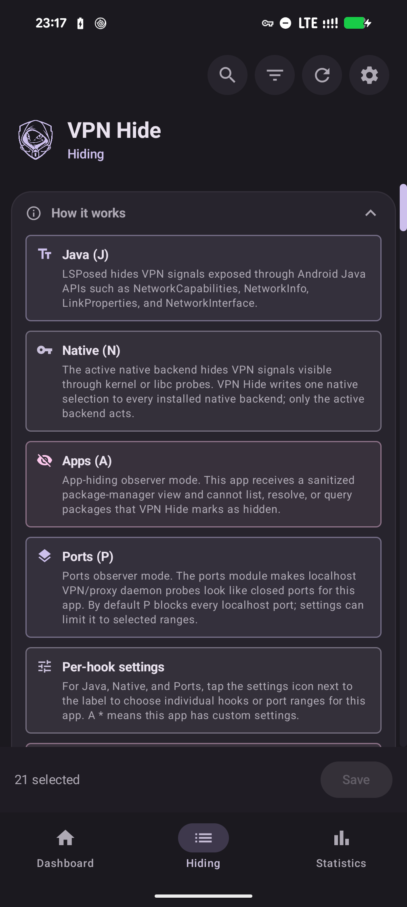
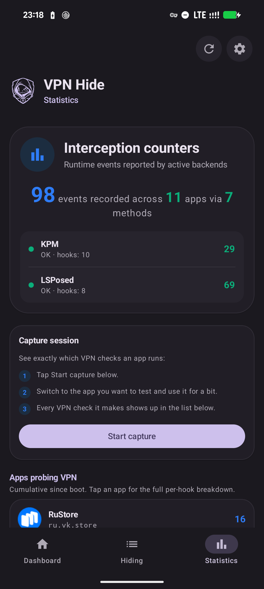
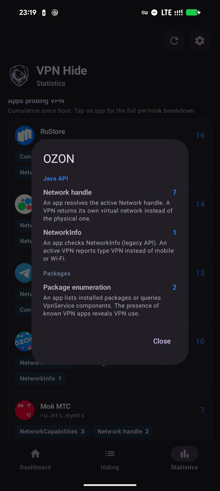
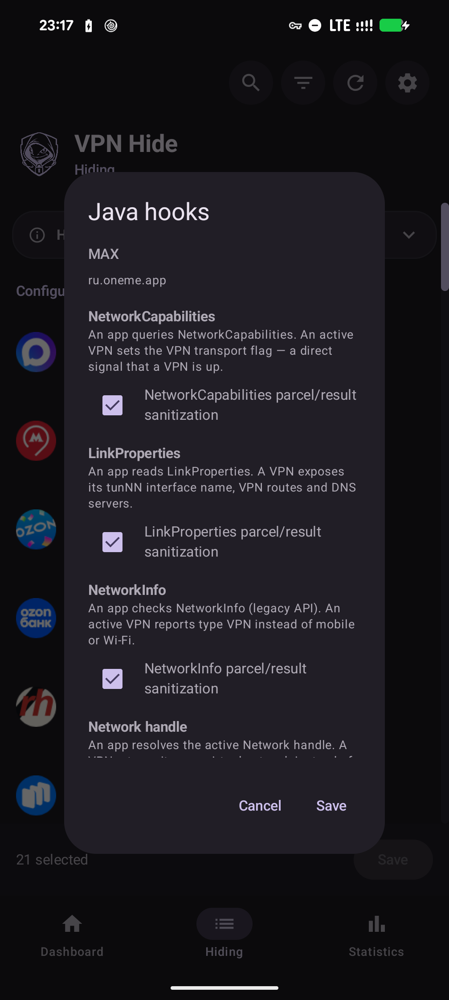
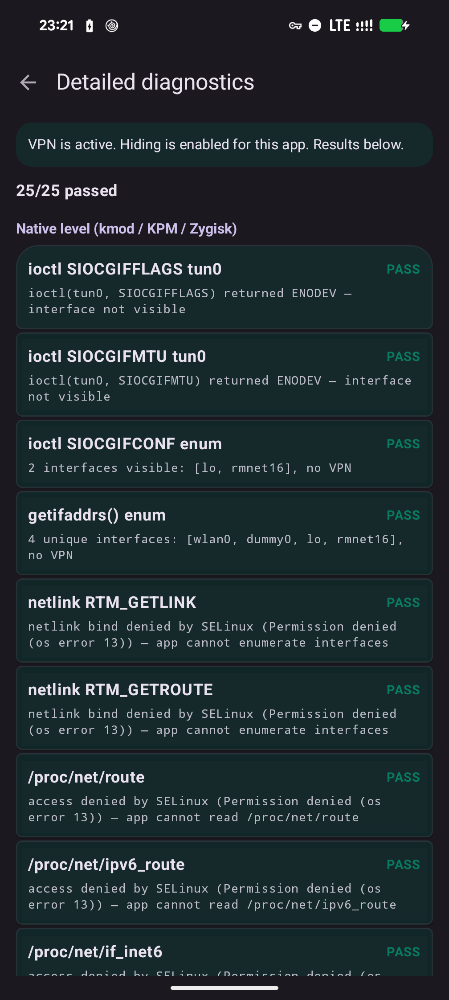
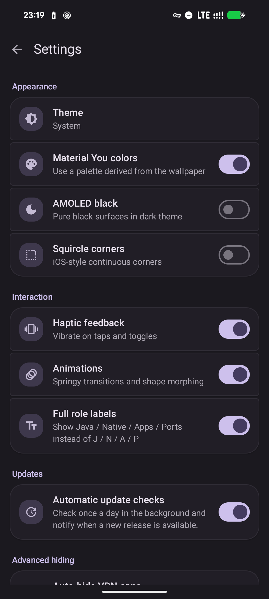
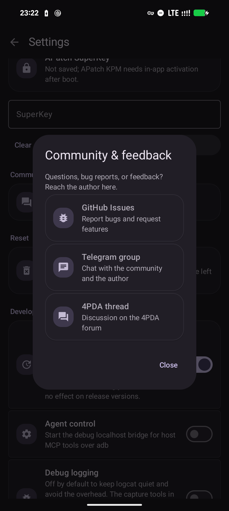

<p align="center">
  
</p>

<h1 align="center">VPN Hide</h1>

<p align="center">Hide an active Android VPN connection from selected apps.</p>

<p align="center">
  <a href="https://github.com/okhsunrog/vpnhide/actions/workflows/ci.yml"></a>
  <a href="https://github.com/okhsunrog/vpnhide/releases/latest"></a>
  <a href="https://github.com/okhsunrog/vpnhide/releases"></a>
  <a href="LICENSE"></a>
</p>

<p align="center"><strong><a href="README.md">Русская версия</a> · <a href="README.zh.md">中文版</a></strong></p>

## Why vpnhide over alternatives?

Existing modules like [NoVPNDetect](https://bitbucket.org/yuri-project/novpndetect) and [NoVPNDetect Enhanced](https://github.com/BlueCat300/NoVPNDetectEnhanced) only cover **Java API** detection and hook **inside the target app's process** via Xposed. This has two critical problems:

1. **Invisible to anti-tamper** — any app with memory injection checks detects the Xposed hooks and refuses to work. The NoVPNDetect Enhanced author explicitly states: *"The module will not work if the target app has LSPosed protection or memory injection checks. For example, MirPay, T-Bank."*
2. **No native coverage** — apps using C/C++ code, cross-platform frameworks (Flutter, React Native), or direct syscalls can detect VPN through `ioctl`, `getifaddrs`, netlink sockets, and `/proc/net/*`. These vectors are completely missed by Java-only hooks.

vpnhide solves both problems with a layered architecture:

**Layer 1 — Java API (lsposed module):** hooks `system_server`, not the target app. `NetworkCapabilities`, `NetworkInfo`, and `LinkProperties` are filtered at the Binder level *before* data reaches the app's process. The app receives clean data over IPC — no injection into its process, nothing for anti-tamper to detect. The same module also hides selected apps from observer apps at the `PackageManager` level (the **Apps** role).

**Layer 2 — Native (kmod, KPM, or Zygisk):** covers native detection paths. Exactly one native backend should be active:
- **kmod** (recommended for supported GKI kernels) — kernel-level `kprobe`/`kretprobe` hooks. Filters `ioctl`, `getifaddrs`/netlink interface, address, route, and policy-rule dumps, and rejects `SO_BINDTODEVICE` / `SO_BINDTOIFINDEX` for hidden interfaces before socket state changes. Zero footprint in the target process: no library injection, nothing to detect.
- **KPM** — a KernelPatch Module implementing the same 11 logical kernel hooks without a GKI-variant-specific `.ko`. Useful for old/non-GKI 4.14 / 4.19 / 5.4 kernels and cases where the `.ko` cannot load. Requires a KernelPatch runtime: APatch or KPatch-Next-Module.
- **Zygisk** — fallback when a kernel-level backend is not possible. Its `libc.so` inline hooks include best-effort `setsockopt` filtering, run inside the target process, and can be bypassed by direct syscalls, so banking and anti-fraud apps may detect it. For those apps, leave Native off and rely on the Java layer.

**Layer 3 — Ports module (portshide):** a separate Magisk module. It blocks selected apps from reaching `127.0.0.1` / `::1` (via iptables), so they can't detect a locally bound VPN / proxy daemon by its open port (the **Ports** role).

The target app's process is completely untouched when using LSPosed + a kernel-level Native backend (kmod or KPM) — no Xposed, no inline hooks, no modified memory regions. Because of that, vpnhide works with banking and government apps that actively detect and block Xposed-based modules.

## What vpnhide hides

vpnhide hides three things from selected apps, all configured per app via the four **J / N / A / P** roles (Java, Native, Apps, Ports):

1. **Interface hiding** — the main goal. It removes VPN interfaces and routes from native APIs (`ioctl`, `getifaddrs`, netlink, `/proc/net/*`, `NetworkInterface`), prevents binding sockets to a hidden interface, and sanitizes Java APIs (`NetworkCapabilities`, `NetworkInfo`, `LinkProperties`). It is delivered by two roles together — **Java (J)** and **Native (N)** — toggled independently.
2. **Port hiding** — blocks localhost access for selected apps so they cannot detect Clash, sing-box, V2Ray, Happ, and similar tools by probing local ports (the **Ports (P)** role).
3. **App hiding** — hides selected installed apps from selected observer apps. Useful against package visibility checks, for example when an app tries to determine whether a VPN or proxy client is installed (the **Apps (A)** role).

## Which modules do I need?

You always need the **VPN Hide app** (`vpnhide.apk`) + LSPosed/Vector for the Java layer + exactly one Native backend for native hiding. The app can also use the optional Ports module if you want localhost port blocking:

- **`kmod`** (stable default) — fully out-of-process, invisible to anti-tamper. Requires a supported GKI kernel: 5.10, 5.15, 6.1, 6.6, or 6.12.
- **`KPM`** — kernel-level backend for 4.14 / 4.19 / 5.4 and other cases where the `.ko` does not fit. Requires APatch or KPatch-Next-Module.
- **`Zygisk`** — fallback if kmod/KPM are unavailable or you do not want to install a KernelPatch runtime.
- **`portshide`** (optional) — install this if you want to block selected apps from probing localhost ports.

Do not install multiple Native backends at the same time. If more than one is installed, the app chooses the active one by priority: kmod, then KPM, then Zygisk; uninstall unused modules.

See [Install](#install) for step-by-step instructions.

## Install

Download the latest release from [Releases](https://github.com/okhsunrog/vpnhide/releases).

### Step 1 — VPN Hide app + LSPosed

1. Install `vpnhide.apk` as a regular app
2. In LSPosed manager, enable the VPN Hide module and add **"System Framework"** to its scope
3. Reboot the device (required — LSPosed hooks are injected into `system_server` at boot, so the module must be active before `system_server` starts)
4. Open the VPN Hide app and grant it root access (Magisk usually prompts automatically; on KernelSU/KernelSU-Next/APatch, grant permission in the manager)

### Step 2 — Native module for interface hiding

Open the VPN Hide app. The **Dashboard** tab will detect your device and kernel, and tell you which Native backend to install:

- For a supported GKI kernel, it recommends a specific kmod file, e.g. `vpnhide-kmod-android14-6.1.zip`.
- For old/non-GKI 4.14 / 4.19 / 5.4 kernels, it recommends `vpnhide-kpm.zip`. If no KernelPatch runtime is detected yet, the app asks you to install KPatch-Next-Module first or use Zygisk as a fallback.
- For other kernels, it recommends `vpnhide-zygisk.zip`.

Install the recommended module:
- **kmod:** via KernelSU-Next / KernelSU / Magisk manager → Modules → Install from storage.
- **KPM:** install `vpnhide-kpm.zip`; under APatch/FolkPatch the app may ask you to save the SuperKey in **Settings → Security** for boot-time activation if the runtime does not expose a trusted KernelPatch `su` token. Under Magisk, KernelSU, and KernelSU-Next, install KPatch-Next-Module first if it is not already installed.
- **Zygisk:** via KernelSU-Next, KernelSU, or Magisk manager → Modules.

Reboot the device after installing the native module.

### Step 3 — Optional: install the Ports module

If you want localhost port blocking, install `vpnhide-ports.zip` via KernelSU-Next or Magisk manager.

This module is independent from the Native backend and is only needed for the **Ports** role in the app.

### Step 4 — Configure hiding

Open the VPN Hide app → **Hiding** tab.

Each app row has roles:

- **Java** — hide VPN through Android Java APIs at the LSPosed/system_server level.
- **Native** — the active Native backend: kmod, KPM, or Zygisk. VPN Hide stores one Native selection; only the active backend acts.
- **Apps** — the app becomes an observer that should receive a sanitized PackageManager view with selected VPN/proxy apps hidden.
- **Ports** — block this app from reaching localhost ports.

Settings can switch from short **J / N / A / P** chips to full role labels. For Java, Native, and Ports, the settings icon next to the label opens per-hook or port-range settings.

Tap Save after making changes.

#### Which app gets configured

Roles go on the **detector app** — the one you are hiding the VPN from (a bank, a government service, a marketplace). The VPN app itself needs no roles here: it is the thing being hidden, and *that* list lives in Settings → **VPN app hiding**.

Common cases:

| What is happening | What to enable |
|---|---|
| A bank must not see that a VPN is up | On the **bank**: Java + Native |
| The bank also scans the installed-app list | Add **Apps** on the bank. Then check Settings → VPN app hiding actually lists your VPN: apps declaring a VpnService are found automatically, anything else is added by hand |
| The bank objects to Zygisk specifically | Turn Native off and keep Java. On a GKI device, switching to kmod or KPM is better — they are invisible from inside the process |
| The app probes a localhost proxy port (127.0.0.1:1080 and friends) | Add **Ports** on that app (needs the ports module installed) |

Worked example: to keep a banking app from seeing either the VPN or the installed WireGuard, give the bank **J + N + A** and make sure WireGuard is in the hidden list. WireGuard itself needs no roles.


Java and kernel-level Native backends (kmod/KPM) apply immediately. Zygisk hooks and Ports rules are picked up by a selected app after force-stop and reopen.

> **Note:** some apps detect Zygisk hooks when Native is enabled for them. Leave Native off for those apps and rely on the Java layer, or use kmod/KPM instead.

<details>
<summary><b>Shell configuration (advanced)</b></summary>

The user-managed config lives in `/data/system/vpnhide_config.json`. Edit the JSON, then run the activator for the installed module:

```sh
su -c /data/adb/modules/vpnhide_kmod/activator
su -c /data/adb/modules/vpnhide_kpm/activator
su -c /data/adb/modules/vpnhide_zygisk/activator
su -c /data/adb/modules/vpnhide_ports/activator
```

Run only activators for modules that are actually installed. LSPosed reads the JSON directly from `system_server`; it does not need an activator. Old `/data/adb/vpnhide_*` `targets.txt` files are the pre-1.0 config. They are no longer user config: the app imports them into the JSON once and deletes them.

</details>

<details>
<summary><b>Manual GKI lookup (if you want to pick the kmod file yourself)</b></summary>

1. On your phone, go to **Settings → About phone** and find the **Kernel version** line. It looks something like `6.1.75-android14-11-g...`
2. You need two parts from this string: the kernel version (`6.1`) and the android generation (`android14`). Together they form your GKI generation: `android14-6.1`
3. Download the matching file from the release: `vpnhide-kmod-android14-6.1.zip`

Alternatively, run `adb shell uname -r` to see the kernel version string.

> **Important:** `android14` in the kernel string is NOT your Android version — it's the kernel generation. For example, Pixels from 6 to 9a all use the `android14-6.1` kernel regardless of whether they run Android 14 or 15.

</details>

## Screenshots

| Dashboard — VPN hidden | Hiding — one app list | How it works |
|:-:|:-:|:-:|
|  |  |  |

| Statistics | Per-hook breakdown | Per-app hook selection |
|:-:|:-:|:-:|
|  |  |  |

| Diagnostics | Settings | Community |
|:-:|:-:|:-:|
|  |  |  |

## Verify

The app has a built-in diagnostics system that catches most setup problems automatically.

**Dashboard** (runs on every app launch):
- Module and backend status (installed, active, version, target count)
- LSPosed configuration validation — reads the LSPosed database to verify that VPN Hide is enabled, System Framework is in scope, and no extra apps are scoped (a common misconfiguration)
- Version mismatch detection — compares installed module versions with the running app version and tells you exactly what to update
- Native backend recommendation — detects your kernel and maps it to the right kmod, KPM, or Zygisk artifact
- Live hiding check (when VPN is active) — runs 13 native checks and 12 Java API checks to verify that VPN is actually hidden

Any issues found are shown as actionable cards with specific instructions.

**Statistics** tab — per-app breakdown of which apps probe for the VPN and how, showing which checks each app runs (counters reported by the active backends).

**Settings → Diagnostics** (Detailed diagnostics) — detailed per-check breakdown with individual PASS/FAIL results for all 25 checks. Useful for troubleshooting when the Dashboard shows incomplete hiding.

## Components

| Directory | What | How |
|---|---|---|
| **[kmod/](kmod/)** | `.ko` kernel module + KPM backend (C) | Two kernel-level Native backends: the GKI `.ko` using `kretprobe`, and the KPM using KernelPatch inline hooks. Both have zero footprint in the target app's process; only one should be active. ([details](kmod/README.md), [KPM](kmod/kpm/README.md)) |
| **[lsposed/](lsposed/)** | LSPosed module + app (Kotlin + Rust) | Hooks `writeToParcel` in `system_server` for per-UID Binder filtering. The APK provides a dashboard (module status, version checks, LSPosed config validation, install recommendations), the Hiding tab for Java / Native / Apps / Ports roles, and diagnostics. ([details](lsposed/README.md)) |
| **[portshide/](portshide/)** | Ports module (Shell + iptables) | Blocks selected apps from reaching `127.0.0.1` / `::1`, hiding locally bound VPN / proxy daemons from localhost port probes. ([details](portshide/README.md)) |
| **[zygisk/](zygisk/)** | Zygisk module (Rust) | Inline-hooks `libc.so` in the target app's process. Fallback when a kernel-level backend is unavailable. ([details](zygisk/README.md)) |

## Detection coverage

| # | Detection vector | SELinux | kmod | KPM | Zygisk | LSPosed |
|---|---|---|---|---|---|---|
| 1 | `ioctl(SIOCGIFFLAGS)` on tun0 | | x | x | x | |
| 2 | `ioctl(SIOCGIFNAME)` resolve index to name | | x | x | x | |
| 3 | `ioctl(SIOCGIFMTU)` MTU fingerprinting | | x | x | x | |
| 4 | `ioctl(SIOCGIFCONF)` interface enumeration | | x | x | x | |
| 5 | All other `SIOCGIF*` (INDEX, HWADDR, ADDR, etc.) | | x | x | x | |
| 6 | `getifaddrs()` (uses netlink internally) | | x | x | x | |
| 7 | netlink `RTM_GETLINK` dump | | x | x | x | |
| 8 | netlink `RTM_GETADDR` dump (IPv4 + IPv6) | | x | x | x | |
| 9 | netlink `RTM_GETROUTE` dump | | x | x | x | |
| 10 | netlink `RTM_GETRULE` policy rules | | x | x | | |
| 11 | Public `/32` or `/128` host route to the VPN server | | x | x | | |
| 12 | `SO_BINDTODEVICE` / `SO_BINDTOIFINDEX` | | x | x | libc | |
| 13 | `/proc/net/route` | blocked | x | x | x | |
| 14 | `/proc/net/ipv6_route` | blocked | x | x | x | |
| 15 | `/proc/net/if_inet6` | blocked | | | x | |
| 16 | `/proc/net/tcp`, `tcp6` | blocked | | | x | |
| 17 | `/proc/net/udp`, `udp6` | blocked | | | | |
| 18 | `/proc/net/dev` | blocked | | | | |
| 19 | `/proc/net/fib_trie` | blocked | | | | |
| 20 | `/sys/class/net/tun0/` and `/proc/sys/net/*/{conf,neigh}/tun0` | blocked | opt-in | | | |
| 21 | `NetworkCapabilities` (hasTransport, NOT_VPN, transportInfo) | | | | | x |
| 22 | `NetworkInfo` (getType, getTypeName) | | | | | x |
| 23 | `ConnectivityManager.getActiveNetwork()` | | | | | x |
| 24 | `ConnectivityManager.getAllNetworks()` + VPN scan | | | | | x |
| 25 | `LinkProperties` (interfaceName) | | | | | x |
| 26 | `LinkProperties` (routes via VPN interfaces) | | | | | x |
| 27 | `NetworkInterface.getNetworkInterfaces()` | | x | x | x | |
| 28 | `/proc/net/route` via Java `FileInputStream` | blocked | x | x | x | |

**blocked** = on stock-enforcing builds (Android 10+) SELinux usually denies untrusted apps access to that `/proc/net/*` / `/sys` file. But **SELinux policy is configured differently across devices and ROMs** (OEM and custom ROMs, `permissive` builds), so only explicit coverage shown in the table should be treated as vpnhide protection.

**libc** = best-effort Zygisk coverage: a direct syscall bypasses the inline hook.

**opt-in** = the `.ko` filesystem-hiding feature is disabled by default. Enable
it in Settings and reboot; when disabled its global VFS probes are not installed.

Important: `ioctl` and netlink dumps are available to a regular app without help from SELinux; on Linux 5.7+, so is the first socket-interface bind. This is how detectors such as RKNHardering bypass the `/proc/net/route` denial through netlink (see [issue #86](https://github.com/okhsunrog/vpnhide/issues/86)). Kernel-level backends (kmod/KPM) cover the native paths marked above with no target-process footprint. Zygisk covers libc-routed calls only; a direct raw syscall bypasses its hooks. On older kernels, the kernel itself rejects an unprivileged interface bind. Everything else is either often SELinux-blocked on stock (device-dependent) or goes through Java APIs and is covered by LSPosed.

KPM implements the same 11 logical kernel hooks as the `.ko`, while the full vector map documents the remaining ABI and behavior differences on older kernels.

The full vector map — per-layer breakdown, SELinux caveats, and known gaps — lives in [docs/detection-vectors.md](docs/detection-vectors.md).

## Building from source

- **kmod**: `./kmod/build.py --kmi android14-6.1` (or `--all`) — auto-spawns the DDK container via podman/docker. Full guide: [kmod/BUILDING.md](kmod/BUILDING.md).
- **KPM**: `python3 kmod/kpm/build.py` — builds the universal `vpnhide-kpm.zip` through the KernelPatch submodule. Details: [kmod/kpm/README.md](kmod/kpm/README.md).
- **zygisk**: `cd zygisk && ./build.py` (Rust + NDK + cargo-ndk)
- **lsposed**: `cd lsposed && ./gradlew assembleDebug` (JDK 17 + Rust + NDK + cargo-ndk)

### Notes for contributors stuck on Windows

If you're on Windows, there are some inconveniences with building some subprojects.

**lsposed**: builds fine in Android Studio.

**portshide**: `cd .\portshide\; python .\build-zip.py` runs fine.

For kmod and zygisk, you'll (unfortunately) need to install [Docker for Windows](https://docs.docker.com/desktop/setup/install/windows-install/).

**kmod**: `python .\kmod\build.py --kmi android14-6.1` — the script picks up Docker and pulls the same `ddk-min` image that CI uses.

**KPM**: build from Linux or WSL. The script expects POSIX tools, `make`/`clang`, the KernelPatch submodule, and the Android NDK; a native Windows build path is not documented.

**zygisk**:
```powershell
docker run --rm -it -v "${PWD}:/workspace" -v "vpnhide_cargo_cache:/usr/local/cargo/registry" -w /workspace ghcr.io/okhsunrog/vpnhide/ci:latest bash -c 'cd zygisk && python3 ./build.py'
```
The reason `zygisk` can't be built directly on Windows is that the `zygisk-api` dependency contains a file named `aux.rs`. Cargo uses `libgit2` for git operations, and `libgit2` refuses to create files whose names _contain_ reserved Windows device names (`AUX`, `CON`, `NUL`, …). You'll get: `cannot checkout to invalid path 'src/aux.rs'; class=Checkout (20)`. [Someone reports](https://superuser.com/a/1929659) that some Windows update made it possible to create files containing reserved words **with** an extension, but `libgit2` hasn't been updated to relax the guard.

## Verified against

- [RKNHardering](https://github.com/xtclovver/RKNHardering/) — all detection vectors clean
- [YourVPNDead](https://github.com/loop-uh/yourvpndead) — all detection vectors clean

Both implement the official Russian Ministry of Digital Development VPN/proxy detection methodology ([source](https://t.me/ruitunion/893)).

## Split tunneling

Works correctly with split-tunnel VPN configurations. Only the apps in the target list are affected.

Using split tunneling together with VPN Hide is strongly recommended.

Detection apps that compare the device-reported public IP against external checkers should stay outside the tunnel — their traffic should go through the carrier, not the VPN.

## Threat model

vpnhide hides an active VPN from specific apps. It is NOT designed for:
- Hiding root or custom ROM presence
- Bypassing Play Integrity
- Fooling server-side detection (DNS leakage, IP blocklists, latency/TLS fingerprinting)

## Known limitations

- `kmod` requires a supported GKI kernel with `CONFIG_KPROBES=y` (standard on Android 12+ devices)
- KPM requires a KernelPatch runtime (APatch or KPatch-Next-Module); do not install KPM together with the `.ko`
- `lsposed` requires LSPosed, LSPosed-Next, or Vector
- `zygisk` is arm64 only
- Direct `svc #0` syscalls bypass Zygisk's libc hooks — use a kernel-level backend (kmod or KPM) for that
- Server-side detection is unfixable client-side — use split tunneling

## Support the project

vpnhide is free, with no ads and no telemetry. There will be no paid features — donating unlocks nothing.

The same list is in the app under **Settings → Support the project**, where addresses copy on tap.

**Boosty** — card payment, one-off or recurring: <https://boosty.to/okhsunrog/donate>

| Coin | Network | Address |
| --- | --- | --- |
| USDT | Tron (TRC20) | `TMskx2wKmPg11VYvHoS93vUQGm7yhcetUU` |
| BTC | Bitcoin | `bc1pmt9u6nux4x7n86zknwdgt9v02lah2tu6d983ak2prc5cwt8hsetq82ganh` |
| GRAM | The Open Network | `UQADYTtMBQdZvmNNEX02R9sACpdnXKlPV8RbuFrxo7JFBRGS` |
| LTC | Litecoin | `MBLKJfPNANH3U41UPJFtha7EPJGdbiW5dZ` |

## License

MIT. See [LICENSE](LICENSE).

The kernel module declares `MODULE_LICENSE("GPL")` as required by the Linux kernel to resolve `EXPORT_SYMBOL_GPL` symbols at runtime.

## Star History

<a href="https://www.star-history.com/?type=date&repos=okhsunrog%2Fvpnhide">
  <picture>
    <source media="(prefers-color-scheme: dark)" srcset="https://api.star-history.com/chart?repos=okhsunrog/vpnhide&type=date&theme=dark&legend=top-left&sealed_token=L6VLoQFGmusCfaI01irFbE2MJWoOX9V4Z66YMzG6z0vD-xjku8IZX4jnDHFYeAjjEne48AgxfoSExLa90tYlqeYq7E32T0DGbdKrR8UTyp0zVCfDeKGdCIku_20sKVi9WBuO4aqa3nBKDnKepezie3AC67kmr-2mazo76SIUyXWpRp8Lb038KZtafha8" />
    <source media="(prefers-color-scheme: light)" srcset="https://api.star-history.com/chart?repos=okhsunrog/vpnhide&type=date&legend=top-left&sealed_token=L6VLoQFGmusCfaI01irFbE2MJWoOX9V4Z66YMzG6z0vD-xjku8IZX4jnDHFYeAjjEne48AgxfoSExLa90tYlqeYq7E32T0DGbdKrR8UTyp0zVCfDeKGdCIku_20sKVi9WBuO4aqa3nBKDnKepezie3AC67kmr-2mazo76SIUyXWpRp8Lb038KZtafha8" />
    
  </picture>
</a>
