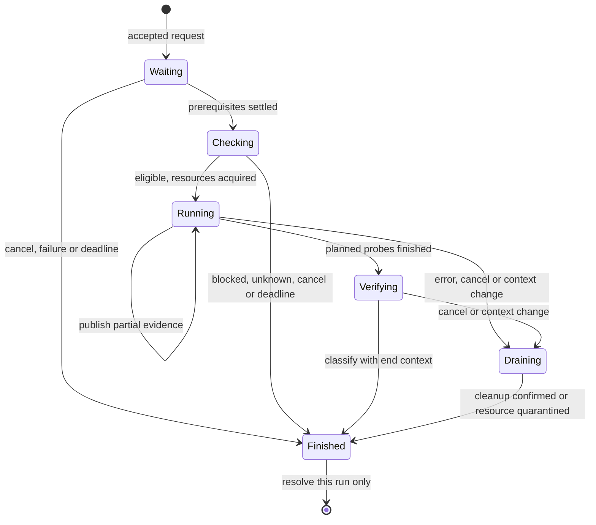

# App state: transition contract

Status: configuration, observation and diagnostic-run coordinators are connected
to the app, and config operations feed diagnostic admission and context. The
shared presentation revision and capture orchestration still use their existing
paths. Sections 13–19 record the implementation stages and their exact boundaries.
This formalizes the direction
agreed on 2026-09-15. It extends [app state design](app-state-design.md) and follows
the [diagnostics investigation](diagnostics-state-analysis.md). Existing runtime
behavior remains documented in [storage](../storage.md) and [diagnostics](../diagnostics.md).

Scope: process-owned config operations, drafts, observations, diagnostic runs,
measurement applicability and capture integration. Names below are domain names,
not a commitment to public Kotlin or JSON names. Wire control-v2/telemetry-v1
remains unchanged. The root transport requirements in section 12 are implementation
gates; these tables do not claim the current transport already satisfies them.

## 1. Ownership and event ordering

Use related machines, each with one owner, rather than a screen-owned copy of each
state. A short process-owned event dispatcher orders cross-machine decisions:

```text
reduce(previous, event) -> next + effects
```

Reducers do not suspend, read Android services, execute commands or format UI text.
Effects run outside the dispatcher and return identified completion events. One
logical event publishes one immutable presentation revision after all affected
reducers have run. Consumers must not independently combine flows of incompatible
revisions. This is an in-process ordering guarantee, not an atomic Android snapshot.

| Owner | State | Exclusive work |
|---|---|---|
| Config coordinator behind `CanonicalConfigRepository` | Initialization, operation queue, confirmed config, phase outcomes | One mutating root operation, through activation/recovery |
| Draft registry and lifecycle state holders | Base identity, field patch, draft revision, submitted revision | Short edit/registration transitions; no lock held through I/O |
| Existing observation cache facades | Last observation, request generation, loading/error | One physical load per resource; coalesce requests |
| Diagnostic coordinator behind `DiagnosticsCache` | Request admission, active run, immutable run records | One suite at a time, including export requests |
| Capture coordinator | Capture phase, logging token, evidence/errors | One forensic capture session initially; overlapping read-only historical exports allowed |
| Pure presentation functions | Setup status, run progress, applicability, evidence summary | No I/O and no independently mutable verdict |

`OperationId`, `RunId`, `CaptureId`, `RequestId`, `DraftId` are process-unique.
An effect also carries a step/attempt identity. Accept its result only if it is the
expected outstanding effect. Duplicate events have no effect. Obsolete observation
results cannot publish. Late mutating-command evidence is routed to recovery, never
silently treated as a new operation or allowed to overwrite a newer config.

An event means the app *received* evidence; dispatcher order is not proof of the
order of independent external system changes. Unknown external ordering stays
unknown in the resulting observation.

Dependency direction is fixed: config effects never await dashboard derivation,
diagnostic completion or capture packaging. Diagnostics may await config effects;
capture may await both. Releasing a write lane schedules observation work but does
not await it. Shared helper/staging resources have explicit owners and separate
paths where concurrent use is necessary; do not solve collisions with a global
root lock that reintroduces this dependency cycle.

Universal rules for the transition tables below:

- An invalid user/API request returns a typed rejection and starts no effect.
- An irrelevant, duplicate or obsolete completion leaves state unchanged.
- Every accepted operation/run handle has its own result; do not await the next
  arbitrary terminal value in a global StateFlow.
- Collector/waiter disposal only detaches that consumer. Explicit cancellation is
  a different event and has the phase-specific rules below.
- No operation or run is resumed from an in-memory state after process death.
  Startup reconstructs observable facts. Accepted work has no survival guarantee.

## 2. Initialization and command admission

Config availability: `Uninitialized`, `Loading(request)`, `Available(config)`,
`Missing`, `Invalid(error)`, `Unavailable(error)`. Keep a last confirmed config
separately when a later read fails; it is historical, not a writable base.

| State / event | Next state and effects |
|---|---|
| Uninitialized / first demand | Loading; issue dedicated canonical read |
| Loading / valid read | Available; assign config revision; start allowed startup reconciliation |
| Loading / absent file | Missing; only explicit startup initialization/import may establish config |
| Loading / malformed or inaccessible | Invalid or Unavailable; show reason, no empty-default write |
| Missing, Invalid, Unavailable / retry read | Loading with new request identity |
| Not Available / ordinary mutation | Reject `config_unavailable`; preserve drafts |
| Startup reconciliation unresolved | Hold mutations as in section 3; reads remain possible |
| Self preparation not completed / request self-test | Terminal `NotStarted(initialization_pending)`; no inferred `selfNeedsRestart=false` |

Config availability alone does not open mutation admission. Startup also checks
whether previous app-owned root effects are quiescent. While that bounded check
runs, coordinator mode is Initializing. Proven quiescence permits explicit startup
initialization/reconciliation and then Open; uncertainty follows the same initial
readback plus one repeat, then Paused rule as an in-process timeout. A new app PID
does not prove an old privileged descendant stopped. The transport must supply
discoverable execution-lifetime evidence across app restarts, or safely remain
paused; no full persistent operation journal or automatic command replay is assumed.
Commands issued by builds that predate the transport are untracked writers, like
module boot scripts: a lane never opened in this boot is adopted directly, and
their bounded, idempotent overlap with the first new-session command is an
accepted risk, not a reboot requirement (decided 2026-09-15).

Startup's automatic self-test intent is armed until initialization is complete and
the first eligible conditions are observed. It is consumed when a suite actually
starts, whether it later completes or fails. Blocked conditions do not consume it.
No automatic second suite is scheduled after failure, cancellation or context
change; explicit retry remains available. All these flags survive Activity
recreation and reset on process death.

## 3. Config operation machine

Coordinator mode: `Initializing`, `Open`, `Recovering(operation, attempt)`, or
`Paused(operation, uncertainty)`. A recovery cause may refer to previous-process
effects rather than an extant in-memory operation. Each accepted operation has:

```text
Queued -> Preparing -> Executing(step) -> Settled(result)
                           |
                           +-> Reconciling(0) -> Reconciling(1) -> Held
```

The immutable result records phases independently: canonical persistence, coupled
secret work and each backend activation. A phase is `NotAttempted`, `Running`,
`Confirmed`, `FailedKnown`, or `Unknown`. `FailedKnown` requires a known outcome;
a shell exit/timeout alone must not imply that the file remained unchanged.

The default effect plan preserves current prerequisites: read/validate current
config, canonical replacement, coupled secret commands if any, native activation,
then ports activation if required. Stop subsequent effect steps on failure. This
does not make the steps transactional; an earlier success remains successful.
Secret material stays inside effect execution, never in observable state/errors.

| From / event / guard | To | Effects and publication |
|---|---|---|
| Open / submit, valid command envelope | Queued | Allocate ID and immutable intent; immediately publish requested switch position/progress |
| Initializing / ordinary submit | Unchanged | Reject initialization_pending; startup bootstrap commands alone may run after predecessor quiescence is established |
| Queued / lane free | Preparing | Read fresh canonical config and required inventory; no whole-root scan solely for config |
| Preparing / read or validation fails | Settled(rejected) | No mutating effect; keep latest confirmed config and caller's draft |
| Preparing / candidate valid, bridge conflicts with registered draft | Settled(ui_edit_conflict) | Reject whole bridge command; no partial write |
| Preparing / candidate equal, no coupled work or explicit activation needed | Settled(no_change) | No write/activation; confirm against the fresh read |
| Preparing / validated candidate | Executing(persist) | Recheck drafts in the dispatch transition; reserve write lane; dispatch effect |
| Executing / canonical replacement confirmed | Executing(next step) or Settled | Publish confirmed config immediately; derive logger; continue prerequisite plan |
| Executing / known persistence failure before replacement | Settled(failed) | Remove pending intent; show latest confirmed position/error |
| Executing / known coupled/activation failure | Settled(partial_failure) | Keep confirmed config; report failed and unattempted phases; offer explicit recovery action |
| Executing / all required steps confirmed | Settled(command_completed) | Release lane; schedule affected observations outside it; no assertion of per-process consumption |
| Executing / outcome unknown | Reconciling(0) | Hold successors; read back phase evidence and transport termination evidence; never repeat mutation |
| Reconciling(0) / still unknown or check fails | Reconciling(1) | Exactly one automatic repeat of the read-only reconciliation check |
| Reconciling(1) / still unknown or check fails | Held; coordinator Paused | Resolve handle once as `unresolved`; show manual recheck; reject queued commands as `mutation_paused` |
| Either reconciliation / effects proven quiescent and phase outcomes known | Settled(reconciled result); Open | Publish actual readback, retain phase detail, release lane; do not auto-run missing effect steps |
| Paused / new mutation | Paused | Reject `mutation_paused`; do not accumulate hidden writes for later |
| Paused / manual recheck | Recovering(manual) | One read-only attempt, no automatic retry budget reset |
| Manual recovery / unknown | Paused | Update recovery evidence; retain same unresolved cause |
| Manual recovery / resolved | Open | Publish actual state and a separate recovery record; previously resolved handles stay immutable |
| Recovery check already active / another manual recheck | Unchanged | Join that read-only check; never launch duplicate recovery or replenish retry budget |
| Queued or Preparing / explicit cancel before mutating dispatch | Settled(cancelled) | Retire read request; no write |
| Executing or Reconciling / explicit cancel | Unchanged | Return `too_late_to_cancel`; finish/reconcile bounded effects |

Reconciliation attempt 0 is the initial readback, attempt 1 is its single automatic
repeat. A matching JSON is insufficient if an activator/descendant can still run.
Late acknowledgements may trigger a recovery decision only with sufficient evidence
that all effects have stopped. A late success line alone does not reopen the lane.

After a known apply failure, a later ordinary command may proceed once effects are
quiescent. Retry activation is a new operation against **current** config, not a
replay of the failed command's old snapshot. After uncertainty resolves, queued
commands rejected during pause require resubmission, so recovery cannot unexpectedly
write old intent. Reads, navigation, drafts and unrelated DataStore settings remain
usable while mutations are paused.

## 4. Drafts and UI priority

A draft is a base config identity plus normalized field edits with per-field edit
revisions. Key overlap includes ancestors: deleting an app conflicts with any of
its edited fields; changing a role boolean conflicts with editing that role's hook
selection. UI edit publication and draft registration occur in the same event.

| Event | State change / operation result |
|---|---|
| Edit a field | Advance field/draft revision; register patch; immediate UI update |
| Observe a new config | Rebase untouched fields; keep edited fields and their revisions |
| Save | Snapshot submitted patch/revisions into a config operation; disable editing that draft during this save in the first implementation |
| Save persistence confirmed | Clear only fields whose current revision equals the submitted revision; rebase to confirmed config; retain operation's activation progress separately |
| Save fails before persistence | Keep patch; restore editing; report error |
| Save remains unresolved | Keep patch and unresolved operation link; allow local editing after handle resolves unresolved, but no new save until recovery |
| Recovery establishes submitted persistence | Clear only still-matching submitted fields; later edits survive; expose recovery outcome |
| Discard | Remove unsaved patch/registration; does not undo already dispatched persistence |
| Activity recreation | Reattach to same draft and operation IDs; do not unregister |
| Process death | Draft lost by design; next startup reads actual storage |

Editing is enabled again after persistence is confirmed; later edits are a new
draft revision even while the prior activation is still running. The same immediate
switch remains disabled until its operation settles or returns unresolved.

Bridge/UI ordering has two distinct cases:

1. A registered overlapping UI edit exists **before mutating dispatch**: reject
   the whole bridge command with `ui_edit_conflict`, application/field identifiers,
   and `persistence=not_attempted`.
2. A new overlapping UI edit arrives **after mutating dispatch but before bridge
   completion**: retain the draft and flag that bridge operation as superseded.
   Finish/reconcile its effects, then return `ui_edit_conflict` with actual phase
   outcomes (`confirmed`, `failed`, or `unknown`) and the current
   `ui_draft_pending` value (true unless that patch was subsequently discarded).
   Never claim no write occurred, and never auto-save the draft to fake rollback.

A bridge operation completed before an edit cannot retroactively fail. UI priority
means its unsaved values remain displayed/protected and its next save wins on those
fields; it does not mean unsubmitted edits are already installed in the backends.
The bridge error envelope must carry structured phase results for this distinction.

Auto-hide reconciliation computes only allowed untouched-field changes and reports
skipped protected fields internally. Bridge mutations are all-or-reject before
dispatch. Whole-config import/reset overlapping any active draft returns a conflict
before dispatch; the UI can save/discard that draft, then explicitly retry. No
silent draft deletion or wildcard replacement over unsaved edits.

## 5. Observation machine

One immutable observation state contains `lastGood`, `requestedGeneration`,
`activeRequest`, and `lastAttempt` (`None`, `Loading`, `Succeeded`, `Failed`).
`lastGood` carries its own interval, source/config identity and generation. A new
attempt never makes the old value new. Errors are structured and retryable.

| Event / guard | Transition and effect |
|---|---|
| Ensure, no observation and no attempt | Start one load |
| Ensure, value/error/load already present | Reuse it; no retry loop from recomposition |
| Explicit equivalent refresh while loading | Join that request's handle |
| Invalidate due to a relevant event | Advance requested generation; retain lastGood; start load if idle, otherwise request one successor |
| Success for active request at requested generation | Publish observation and finish its waiters |
| Success/error for older generation | Do not publish; finish old waiters with `superseded`; start one successor for latest generation |
| Error for current request | Publish Failed, keep lastGood historical; resolve waiters with error |
| Explicit retry after failure | New request identity; loading with previous value/error evidence retained |
| Waiter disappears | Detach waiter; process-owned load continues |

Joining is allowed only when the active request satisfies the caller's minimum
generation and collection-start time. A request for an observation made after a
modal opened or a command settled may need the coalesced successor instead. Its
handle follows that identified request; it cannot accept an older cached terminal
result. A physical-read timeout with unproven helper cleanup uses the resource
quarantine rules in section 7, rather than starting a competing successor.

The old physical read drains before its successor starts; cancellation is not proof
that blocking work stopped. Deadline failure is explicit, not endless loading. A
missing dependency produces `initialization_pending`, not a poisoned cache entry.

Routing is an observation with outcomes `VpnOff`, `SelfExcluded`, `Routed`, or
`Unknown(reason)`. Restart requirements belong to process readiness, not network
facts. Derive diagnostic eligibility in this precedence:

1. Initialization incomplete -> `Initializing`.
2. Known restart/reboot requirement -> `RestartRequired(action, reason)`.
3. Relevant config effects unsettled/unknown/known failed -> `Applying` /
   `ApplicationUnknown` / `ApplicationFailed` until explicit repair or fresh
   sufficient runtime evidence resolves the relevant application state.
4. Routing refresh outstanding or observation uncertain -> `Checking` / `Unknown`.
5. Known no VPN or excluded UID -> `VpnOff` / `SelfExcluded`.
6. Otherwise -> `Eligible(context)`.

One consumer never converts `Unknown` into a positive/negative network fact. All
consumers use this same derivation, including capture guidance and bridge reads.

## 6. Measurement context and applicability

At admission, define the probe plan and a dependency projection for the self UID:
process/boot identity, app/probe version, self role/hook selection, relevant global
features, module/runtime/coverage evidence, network identity and self-routing
evidence. Record collection start/end, observation request IDs and uncertainties.
Whole-config revision alone is not this projection.

Maintain two monotonic epochs: `changeEpoch` for a known relevant transition and
`uncertaintyEpoch` for a possible transition not yet classified. An uncertain event
may be cleared by a fresh consistent observation if no known change was recorded.
A known off/on or mutation transition never disappears just because values later
match. A run intersecting unresolved uncertainty cannot yield a current positive
summary. Undetected external changes remain a limitation, not an asserted guarantee.

| Event | Dependency / run effect |
|---|---|
| UI draft changes only | No applied-context change |
| Relevant mutating effect dispatched | Advance changeEpoch before side effects; mark active run interrupted; context is Applying |
| Such a write later fails | Reobserve; do not resurrect the interrupted run as current |
| Debug-only or proven unrelated per-app edit | No semantic invalidation; coordinate shared probe/capture resources if activation touches them |
| Imports, reset, shared UID change, unknown impact | Conservatively relevant until a pure dependency projection establishes otherwise |
| Known VPN/network identity, self-route, runtime mask or process change | Advance changeEpoch; interrupt affected active run; old measurement Changed |
| VPN callback without classified difference | Advance uncertaintyEpoch; invalidate observations; current applicability Unverified until classified |
| Observation fails / root lost | Current applicability Unverified; never replace results with empty success |
| Statistics/UI preference change | No self-test invalidation |

“Unrelated app” requires different effective UID and no shared global capability
change. A debug-only activation must not be assumed harmless if it reloads or
changes effective self runtime state; the adapter reports its actual impact. The
initial fallback for unclassified operations is relevant, not silently safe.

An immutable measurement has `RunId`, subject, probe plan/coverage at that time,
per-probe observations and provenance, start/end context, execution outcome and
context-integrity result. Raw observations gathered after a known interruption may
be retained as evidence but must not be attributed as if collected in stable
conditions. Coverage of an old measurement is never recalculated using a new backend.

Applicability is a pure projection, not a mutable flag inside the measurement:

| Inputs, in precedence order | Applicability |
|---|---|
| No measurement | Absent |
| Context changed during run, different process, or known relevant transition since | Changed(reasons) |
| Measurement lacked required context evidence, current conditions unknown, or refresh pending | Unverified(reasons) |
| Comparable required evidence and no known relevant transition | MatchesLastObservation(observationId, observedAt) |

`MatchesLastObservation` is deliberately bounded to observations; neither a TTL nor
an app revision proves continuous backend consumption. Failed observation alone
need not permanently discard a prior measurement: successful reobservation can
restore applicability if no known relevant change occurred. Interrupted measurements
cannot be restored this way. Execution/evidence sufficiency is checked separately.

## 7. Diagnostic execution machine

Keep `activeRun`, optional `pendingRequest`, and retained immutable records separately.
An unsuccessful new attempt never deletes the last completed measurement. At minimum
retain the latest attempt and latest complete measurement; pin any record referenced
by an open view/export until that owner releases it. Do not keep unbounded history.

States for an admitted request: `Waiting(reason)`, `Checking`, `Running(stage)`,
`Draining(reason)`, `Verifying`, `Finished(outcome)`. Terminal outcomes:

- `NotStarted(reason)` with no probes (blocked prerequisites or explicit rejection).
- `Completed(measurement)` including leaking or unmeasurable probes.
- `Interrupted(reason, evidence)` for cancellation/context change.
- `Failed(stage, error, evidence)` for execution failure.



| From / event / guard | To and effects |
|---|---|
| No active run / explicit check request | Allocate ID and publish Waiting or Checking synchronously before returning handle |
| Relevant config operation already accepted | Waiting(operation IDs) until those operations settle; reject on uncertainty/failure requiring recovery |
| Checking | Request fresh context observation; do not reuse a stale eligibility value |
| Checking / observation superseded | Continue with successor only within the original admission deadline |
| Waiting / required operations settle successfully | Checking; issue fresh context observation |
| Waiting / required operation fails or becomes unresolved | Finished(NotStarted(application_failed or application_unknown)) |
| Waiting / newly accepted relevant operation | Extend dependency set without extending original deadline |
| Waiting or Checking / deadline expires | Finished(NotStarted(deadline_exceeded)); retire own observation waiter |
| Checking / known block or observation error | Finished(NotStarted(reason)); resolve this handle immediately |
| Checking / Eligible and resources free | Capture start context/plan; Running(core); consume startup auto intent if applicable |
| Running / core completed | Publish immutable partial evidence for this run; Running(slow) |
| Running / all planned probes finished | Verifying; capture end context and compare relevant epochs |
| Verifying / stable required context | Finished(Completed); classify evidence; resolve this run's handle |
| Verifying / context changed or unverifiable | Finished(Interrupted(context_changed or context_unverified)); retain evidence |
| Running / a probe is unobservable | Record NotMeasured with specific reason; continue plan if safe |
| Running / suite execution fails | Draining(error); stop new probes and await bounded cleanup, then Finished(Failed) |
| Running or Verifying / relevant change | Draining(context_changed); stop new probes; retain evidence; do not restart automatically |
| Waiting or Checking / explicit cancel | Finished(Interrupted(cancelled)); retire pending read/waiter |
| Running or Verifying / explicit cancel | Draining(cancelled); do not launch a successor until physical probe resources are released |
| Draining / cleanup confirms quiescence | Finished with recorded reason; admit compatible pending request |
| Draining / deadline, quiescence not established | Resolve Finished with resource uncertainty; quarantine probe resource until recovery; reject successors requiring it |
| Any / screen or one waiter closes | No execution transition |
| Finished / late stage response | Ignore for current publication; never turn old/incomplete evidence into a new run |

When Checking is invalidated by a known change before probes start, finish
`NotStarted(context_changed)` rather than following endless changes. Its explicit
caller can retry; the unconsumed startup intent waits for the next stable eligibility
observation. Automatic context refreshes do not produce automatic completed-test reruns.

Request admission while busy:

- Join an active non-draining run only if subject, plan, context and capture
  requirements match and its context remains valid. Return the actual shared RunId.
- Otherwise allow one pending explicit request, joining equivalent pending requests;
  reject a different additional request as `diagnostics_busy` rather than hiding
  an unbounded queue. UI shows the waiting reason and can cancel its owned request.
- A forensic request cannot join a run whose probes began before its logging and
  counter baseline. It waits for the active run to settle, then prepares capture.
- Cancelling an awaiter never cancels a shared run. Only the run owner (or explicit
  global Stop action with cancellation authority) can request execution cancellation;
  a joined bridge consumer can only detach.

Waiting/checking/running/cleanup all have finite adapter deadlines. Waiting for an
operation that becomes paused finishes NotStarted(application_unknown), not an
endless spinner. A pending request retains its original deadline and is checked
again on admission. After a completed run, a new explicit request always allocates
a new run; it cannot be satisfied by the old terminal StateFlow value.

Probe resources have a separate lifecycle so a terminal handle never implies that
an uninterruptible helper vanished:

| Resource / event | Next state |
|---|---|
| Free / admitted effect | Busy(effect ID); only that owner can release it |
| Busy / confirmed completion or cleanup | Free; admit next allowed effect |
| Busy / deadline without cleanup proof | Quarantined(evidence); resolve waiting requests with resource_unavailable |
| Quarantined / explicit recovery | One bounded read-only termination check; new probes remain rejected |
| Recovery / confirmed quiescence or verified process/boot replacement covering that helper | Free |
| Recovery / insufficient evidence | Quarantined with updated reason |

Quarantine affects that resource, not all app reads. External helpers can outlive
the app: startup must establish a safe helper session (unique staging/resource
identity or verified cleanup) before launching probes, even though its in-memory
quarantine was lost. Restarting an Activity cannot clear quarantine.

## 8. Evidence and presentation rules

Keep per-vector outcomes, owned/unowned scope and provenance. Stable probe IDs are
required for Java/native-extra checks too. Native attribution uses its differential;
Java attribution remains explicitly gate-based inference. Preserve `NothingToLeak`
and permission-blocked outcomes as distinct from backend suppression.

Freeze the planned vector set at start; never drop unavailable probes from the
denominator to manufacture full coverage. A typed unsupported/not-applicable
reason may exclude a vector only through the probe plan, not a failed read.

For each layer expose counts for backend-hidden, system-blocked, nothing-to-leak,
leaking, not-measured and not-yet-run, plus uncovered observations separately.
Derive the owned-scope headline in this precedence:

| Evidence | Headline meaning |
|---|---|
| At least one owned leak observed | Owned leak observed; attach historical/partial qualifiers where needed |
| No attributable observation of hiding/leak (only nothing-to-leak or unavailable) | Insufficient evidence to assess hiding |
| No owned leak, some hiding/blocking evidence, required probes incomplete/unmeasured | Partial verification; show missing coverage |
| Complete and interpretable plan, hiding/blocking evidence, no owned leak | No leak observed in the tested scope; show attribution counts |

This is not a replacement for module presence/readiness. A system-blocked vector
supports limited visibility, not that a module worked. Unowned leaks stay in a
neutral coverage section and do not inflate actionable issue counts. Findings
from an interrupted run remain observations with context warnings, not a fresh
backend verdict. Nothing here claims every selected app is protected.

Dashboard, detail and bridge use the same `Presentation(revision, setup, eligibility,
activeRun, lastAttempt, selectedMeasurement, applicability, findings)` projection:

- Setup describes persistence/application/restart and observed module health.
- Progress appears immediately and never uses null as a synonym for loading.
- A failed latest attempt is visible even if a previous complete measurement exists.
- A positive current summary requires completed execution, sufficient evidence and
  MatchesLastObservation; historical findings remain accessible without that claim.
- VPN-off/excluded and observation errors have explicit explanations/actions. They
  do not suppress unrelated module errors or make support capture inaccessible.
- Detailed views identify the run they show; updates to progress cannot silently
  replace a user-selected historical measurement.

## 9. Capture and API integration

Separate operations: read known state, refresh observations, request/await a check,
export a selected run, perform a fresh check with capture, record third-party logs.
Every export records which operation was requested and which RunId, if any, it
contains. `generatedAt` is payload assembly time; measurement times stay separate.

Historical export pins its selected immutable record, needs no fresh probes and
does not change logging. Current context, if included, is a separately dated
section. A fresh forensic session follows:

```text
Queued -> PreparingLogging -> Baseline -> Checking/Recording
       -> CollectingEvidence -> ReleasingLogging -> Packaging -> Finished
```

| State / event | Transition / outcome |
|---|---|
| Queued / suite lane available | Reserve it for this forensic session; PreparingLogging |
| Queued / cancel or admission deadline | Finished(cancelled or busy); no token acquired |
| PreparingLogging / setup confirmed | Baseline; then request the fresh run or begin recording |
| PreparingLogging / setup failed or unresolved | Record missing logging; collect available evidence without clearing buffers |
| Baseline / capture read fails | Record missing baseline; continue with explicit limitation |
| Checking / run completed, blocked, failed or interrupted | CollectingEvidence with identified run/attempt outcome |
| Recording / stop, process error or size/duration limit | Stop/drain recorder; CollectingEvidence; retain partial recording/error |
| CollectingEvidence / complete or deadline | ReleasingLogging, retaining successful sections and failure reasons |
| Any state after token acquisition / explicit cancel | Stop new acquisition, drain active helpers, then ReleasingLogging; retain existing evidence |
| ReleasingLogging / confirmed cleanup or deferred recovery obligation | Packaging with cleanup outcome; never wait indefinitely for a paused mutation lane |
| Packaging / file written | Finished(artifact, completeness, errors, cleanup status) |
| Packaging / file error or deadline | Finished(artifact_failed, errors, cleanup status) |

The forensic reservation prevents an ordinary run from starting between logging
setup and baseline. It does not reserve the config lane or prevent user writes;
relevant writes interrupt the run normally. Release the suite reservation once
its probes are quiescent, or quarantine their resource. If setup cannot support a
run, release the reservation and collect partial support evidence. Pure third-party
recording holds capture ownership but needs no suite reservation after setup.

All failure/cancel paths after token acquisition pass through ReleasingLogging.
Capture tokens belong to captures, never composables. Acquire/release their desired
state in the ordered config coordinator; `effectiveDebug = debugSwitch OR tokens`.
Release is idempotent and never restores an old whole-config snapshot. A stopped
capture loses its token even if backend cleanup cannot yet be persisted; the
coordinator separately tracks desired/confirmed logging discrepancy and recovery.

If mutations are paused, cleanup cannot bypass the write barrier. Record
`logging_restore_pending` and retain a recovery obligation; do not announce logging
disabled. On safe recovery, recompute from current user intent and remaining tokens
before permitting new ordinary mutations. This obligation is recomputed at startup
from persisted debug/debugSwitch after process death, not from a lost token list.

Failure to enable logging or to establish self-test eligibility produces a partial
support session with explicit missing evidence. Do not clear existing log buffers
when logging setup failed. A logcat recording concerns its selected reproduction,
not the recorder app's self-routing verdict; it can proceed with a warning. Failure
to obtain root evidence must not suppress already-collected app-side evidence.
Failure to create/write the archive is an explicit artifact failure, never a
reported successful file. A packaging deadline cannot falsely mark cleanup complete.
Package only finalized files or bounded immutable copies; a recorder whose
termination is unproven must not be represented as a completed recording.

Keep compatibility explicit: existing `getState(refresh=true)` remains an observation
refresh, not a hidden forced suite run. A new run request has its own handle/API.
New measurement/attempt/eligibility meanings require a bundle schema change and a
bridge protocol compatibility decision when implemented. Keep old wire backend
protocols untouched; do not silently reuse old `Ok`/null fields for new meanings.

## 10. Invariants

| ID | Must always hold |
|---|---|
| I1 | At most one app mutation has uncompleted or unproven root side effects |
| I2 | Confirmed config is published only from confirmed persistence or identified readback, never from optimistic UI intent |
| I3 | Failed activation never rolls back confirmed config; unknown persistence never becomes a confirmed rollback |
| I4 | No stale observation overwrites a newer confirmed config or clears a newer error/loading state |
| I5 | Every accepted handle resolves at most once to its own operation/run; paused/quarantined outcomes are explicit |
| I6 | No shared work is cancelled because an Activity, collector or joined waiter disappears |
| I7 | An older save completion cannot erase a newer draft field revision |
| I8 | Pre-dispatch bridge conflicts write nothing; post-dispatch conflicts disclose actual effects |
| I9 | No probe suite overlaps another suite or reuses a quarantined probe resource |
| I10 | A completed measurement and its original coverage/context are immutable |
| I11 | Context changes/unknown observations cannot produce a fresh positive summary from old or mixed-context evidence |
| I12 | All-unmeasured or nothing-to-leak-only results cannot claim proven hiding |
| I13 | Gate failure, blocked eligibility, execution failure and detected leak remain distinct in UI/API/bundles |
| I14 | Capture release happens once logically; logging restoration is never falsely acknowledged |
| I15 | No secret enters state, diagnostic payloads, conflict fields or error text |
| I16 | Recomposition, timer ticks and observation refresh do not independently schedule completed-test reruns |

## 11. Scenario traces for implementation tests

These are acceptance traces, not executed tests. Fake effects must expose explicit
suspension points at dispatch, file replacement, activation, core/slow probes and
publication. Assert intermediate publications and effect counts, not just final values.

| ID | Events | Required result / invariants |
|---|---|---|
| T1 | Two unrelated config commands submitted from one old screen snapshot | Both patches survive fresh execution reads; I1–I3 |
| T2 | Toggle -> JSON confirmed -> activation fails | Immediate requested position; confirmed position retained with apply error; I2–I3 |
| T3 | Timeout -> initial readback unknown -> automatic repeat unknown | Two read-only checks total; pause; queued handles rejected; no new writes; I1, I5 |
| T4 | T3 -> late success line without termination proof -> manual recovery | Stay paused until full proof; never duplicate write/activation; I1 |
| T5 | Root load A -> relevant invalidation -> A success -> load B failure | A cannot publish; B error plus lastGood historical; I4 |
| T6 | UI dirty field -> overlapping bridge command | ui_edit_conflict, no persistence; unrelated field command allowed; I8 |
| T7 | Bridge mutating dispatch -> UI edits same field -> root success | UI patch retained; bridge conflict includes confirmed persistence; I7–I8 |
| T8 | Save revision A -> unresolved -> edit B -> manual readback confirms A | Preserve B; historical handle unchanged; I5, I7 |
| T9 | Active run -> Activity recreated / bridge awaiter disconnects | Same RunId continues; no second suite; I6, I9 |
| T10 | Old NotStarted/Failed -> explicit retry | Synchronously allocate new request; waiter never receives old terminal result; I5 |
| T11 | Core complete -> slow phase error | Partial evidence retained; failed attempt visible alongside last complete measurement; I10, I13 |
| T12 | Complete run A -> known VPN off -> VPN on with same apparent identity | A stays Changed; no automatic rerun; I11, I16 |
| T13 | Complete run -> root read error -> consistent successful reobservation, no known change | Unverified then MatchesLastObservation; dates preserved; I10–I11 |
| T14 | Core probes -> relevant save dispatched -> late probe response | Interrupted evidence; late response cannot certify new config; I10–I11 |
| T15 | Eligible -> network event between app and root samples | Context interrupted/unverified; no fresh differential claim; I11 |
| T16 | Complete suite: all NotMeasured; then nothing-to-leak-only fixture | Insufficient evidence in UI, bridge and export; I12–I13 |
| T17 | Current gate unknown with old successful test | Explicit unknown everywhere; history visible; no endless spinner/current green; I11, I13 |
| T18 | Active normal run -> forensic request | Wait for own baseline/logging before a new suite; cannot join old probes; I9 |
| T19 | Capture -> user turns debug off -> capture ends twice | Effective logging kept during token; one release; restore current intent; I14 |
| T20 | Capture ends while mutation unresolved | Stop recording; release token; pending cleanup evidence; no barrier bypass; I1, I14 |
| T21 | Blocked self-test / failed root during support collection | Partial artifact when writable, explicit unavailable evidence, no fabricated verdict; I13 |
| T22 | Owned leak plus unowned leak; then only unowned leak | Actionable failure only for owned scope; uncovered observations remain visible; I12–I13 |
| T23 | Cancel running check -> helper cleanup times out -> request new check | Terminal interruption plus resource quarantine; no overlapping helper; I5, I9 |
| T24 | Explicit check waits on save -> save becomes Paused | NotStarted(application_unknown); no indefinite waiter; I5 |
| T25 | Boot changes / app process dies during operation or capture | No claimed continuation; fresh initialization/reconciliation, no inherited draft; I1–I3, I14 |
| T26 | Whole import/reset with open draft; then discard and resubmit | First rejection has no effect; second uses fresh config; I7–I8 |
| T27 | Debug or distinct-UID target edit with verified unchanged self projection | No new suite and no false semantic change; refresh resource observations as needed; I16 |
| T28 | UI render and agent snapshot from same presentation revision | Identical eligibility, selected RunId, applicability and findings; I13 |
| T29 | Canonical remember setting persists -> secret command fails or times out | Explicit independent phases/repair; no secret in logs, state or bundle; I1–I3, I15 |
| T30 | Capture reserves suite -> logging command waits on config lane | Config completion does not wait for suite/dashboard; bounded capture outcome, no cycle; I1, I5, I9 |

## 12. Implementation boundary and validation

The state-machine policy above is specified; these concrete adapters must be
implemented and verified before making runtime guarantees:

- Root phase evidence, atomic-replacement outcome and descendant quiescence on
  supported root managers, including discoverable previous-process command
  lifetimes. If quiescence cannot be established, Paused is the designed outcome,
  not a gap to bypass with another timeout or a new app process.
- Typed coupled-secret steps preserving current canonical-before-coupled ordering,
  with redacted evidence and explicit repair actions for partial persistence.
- Backend-specific impact projection and restart/readiness evidence. Kernel boot
  features, Zygisk process specialization and LSPosed system_server lifetime are
  different; never infer consumption from a command exit alone.
- Finite deadlines for each adapter and resource ownership for shared staging
  paths/native probes. Choose measured constants in implementation; expiration has
  the fixed transitions above, never invented success.
- One presentation revision across feature facades, stable probe IDs, and bundle /
  bridge versioning with explicit field semantics and compatibility fixtures.

Implementation order: pure models/reducers and T1–T30 with fake effects; root/config
transport and all writers; observation generations; process-owned run execution;
shared presentation and capture/API serialization. Integrate in validated steps,
retaining current runtime paths until each replacement's contracts are satisfied.
Use existing facades/parsers/coverage rules rather than parallel global stores.

Run applicable Kotlin tests, ktlint, detekt, CPD and Android lint for code changes.
Then separately validate root timeouts/late effects, real VPN transitions, Activity
recreation, process restarts and capture cleanup on devices. Pure reducer tests
prove decisions for supplied events; they cannot prove the adapters report reality.

## 13. First implementation: pure transition cores

The first implementation adds ordinary Kotlin data models and top-level pure
functions, without a new dependency, store singleton, coroutine scope, JSON schema
or backend protocol. Effects are values; nothing in these reducers executes root
commands or calls Android services. Existing facades are not connected yet.

Paths below are relative to `lsposed/app/src/main/kotlin/dev/okhsunrog/vpnhide/`:

| Core | Implemented behavior | Tests in `src/test/kotlin/dev/okhsunrog/vpnhide/` |
|---|---|---|
| `ConfigOperationData.kt`, `ConfigRecoveryData.kt` | Ordered admission/preparation, identified phase effects, early confirmed config, independent failures, bounded readback, held mutations, manual recovery, before/after-dispatch UI conflicts | `ConfigOperationDataTest.kt` |
| `CanonicalSnapshotData.kt`, `StateTransitionData.kt` | Safe effect identities/error categories; detach concrete config and field-path collections at retention boundaries | Config operation snapshot/conflict cases |
| `ObservationData.kt` | Generation-aware load publication, equivalent-request join, successor-generation wait, last-good retention, failure and identified resource recovery | `ObservationDataTest.kt` |
| `DraftData.kt` | Untouched-field rebase, revision-aware save acknowledgement, capture token/user intent versus confirmed logging | `DraftDataTest.kt` |
| `diagnostics/DiagnosticRunData.kt`, `diagnostics/DiagnosticRunControlData.kt` | Identified runs, bounded pending admission, operation dependencies, progressive evidence, context interruption, independent drain deadlines, quarantine, immutable latest attempt/complete measurement | `DiagnosticRunDataTest.kt` |
| `diagnostics/MeasurementData.kt` | Original/start/end context, applicability and scoped evidence summaries; current success also requires eligible conditions | `MeasurementDataTest.kt` |
| `diagnostics/DiagnosticEligibilityData.kt` | Shared readiness precedence; unknown routing cannot reuse historical routed state as eligibility | `DiagnosticEligibilityDataTest.kt` |

The tests supply effect responses explicitly, including obsolete responses and
duplicate deadline events. They do not sleep or depend on actual coroutine
scheduling. A request deadline and the subsequent drain deadline have different
identities; replaying the former cannot expire the latter. Recovery evidence also
belongs to the specific quarantined effect, preventing an old successful cleanup
response from releasing a newer quarantine.

### What these tests establish

- T1–T8: operation sequencing, independent phase results/recovery, field overlap and
  revision behavior. T1 currently proves when preparation happens; typed canonical
  patch construction and real fresh reads remain to be integrated.
- T10–T17: new run identity after old failure, partial evidence retention, context
  change/uncertainty and evidence sufficiency. T17 also exercises the pure shared
  eligibility decision against a failed observation with historical routed data.
- T18/T23/T24: incompatible capture identities cannot join a run, draining resources
  cannot be reused, and failed operation dependencies finish waiting requests.
  Actual logging/baseline preparation for T18 is still capture-adapter work.
- T19: token ownership and desired versus confirmed logging, including duplicate
  release and late confirmation. T29: canonical/secret phase independence; the
  core types never take a secret or arbitrary root-output string.

These are core portions of the traces, not completion of all thirty integration
scenarios. These pure tests do not exercise Android Activity recreation or
coroutine ownership. Likewise, explicit fake responses establish
reducer ordering, not truthful root acknowledgements or hardware behavior.

Validation on 2026-09-15: `./gradlew :app:testDebugUnitTest :app:detekt cpdCheck
:app:ktlintCheck :app:lintDebug` from `lsposed/` passed. The unit suite contains
570 tests, including 44 new transition-core tests; none failed or were skipped.
No APK/device or Android lifecycle validation was performed for this stage.

### Remaining work before runtime connection

1. Startup/config availability and predecessor-quiescence transport. The operation
   core currently starts with an already-readable confirmed config and proven
   predecessor quiescence; its constructor documents this precondition.
2. Typed config intents, their authoritative write/impact sets, validation and
   no-op planning. `Prepare` identifies the operation; the future coordinator
   must associate that ID with its typed intent and read current canonical data
   before constructing the candidate. It must not reuse a screen's full snapshot.
   Whole import/reset and auto-hide draft rules still need their typed producers.
3. The process-owned dispatcher/effect runner: publish before executing effects,
   associate each handle with its own completion, and forward relevant operation
   acceptance/dispatch/completion events to diagnostic dependencies/context.
   Decide absolute adapter deadlines and cancellation authority there. Generic
   observation/draft payloads must be immutable values supplied by their adapters.
4. Connect the existing `StateCache`, config and diagnostic facades; compute real
   self-context projections and probe plans with stable IDs. The pure request
   deadline is armed once on admission, including for pending requests; drain
   effects arm a separate cleanup deadline.
5. Capture reservation/collection/packaging and deferred cleanup through the config
   barrier (T20/T21/T30); UI lifecycle holders and a common presentation revision
   (T9/T28); import/reset integration (T26) and concrete impact classification (T27).
6. Bundle/bridge compatibility, startup/process-death reconstruction (T25), and
   device validation. No serialized types or runtime wire semantics changed in
   this first core implementation.

## 14. Mutation transport implementation

The next stage implements `vhmutate` plus a bounded Kotlin process runner,
versioned binary staging and typed receipt/readback adapters. Its protocol,
quiescence proof, limits, device evidence and exact migration boundary are in
[root mutation transport](../root-mutation-transport.md). The transport is packaged
but existing app writers are not connected yet.

Recovery can consume a still-undispatched sequence in transport metadata. This
fences a root launch delayed beyond the app timeout; it never repeats a config,
secret or activation effect. The “read-only” recovery policy in section 3 excludes
application mutations, while permitting this lifetime-metadata update.

## 15. Coordinator engine and typed config edits

`ConfigCoordinator` now executes the config reducer through identified coroutine
effects; `ConfigRootIo` connects it to the retained root session and receipts.
Typed edits apply to fresh preparation reads, preserve declared intent for conflict
checks, support no-op plans and keep persistence separate from activation failure.
The engine and adapter are exercised by coroutine/adapter tests; existing app
writers and UI are not connected yet. The exact implementation, validation and
all-writer migration boundary are in [config coordinator](../config-coordinator.md).


## 16. Configuration runtime connection

All app configuration producers now use the coordinator and root transport.
Settings switches render optimistic intent with progress; Activity ViewModels
retain editor drafts and acknowledge only saved revisions. Capture logging tokens,
bridge conflicts, cleanup/reset and startup share this ownership. Implementation,
validation boundaries and remaining observation/diagnostic work are tracked in
[config coordinator](../config-coordinator.md). Earlier implementation sections above
record the intermediate stages; their disconnected-runtime statements are historical.

## 17. Observation runtime connection

`StateCache` now executes the observation reducer in a process-owned coordinator.
Root invalidation synchronously advances dependent generations; obsolete success
and failure cannot publish. Awaiters join shared reads and can detach without
cancelling the worker. Read deadlines quarantine a still-running worker until it
returns, with no overlapping replacement. App inventory metadata is published
with its app list, and root-derived projections carry source observation IDs.

This does not implement an atomic presentation revision across all screens and
diagnostic measurements. The existing diagnostic run lifecycle, capture stages
and their legacy subprocesses remain outside this connection. Concrete deadlines,
retry behavior, dependencies and validation are documented in
[observation coordinator](../observation-coordinator.md).

## 18. Diagnostic execution runtime connection

`DiagnosticsCache` is now a facade over a process-owned `DiagnosticRunCoordinator`
that executes `reduceDiagnosticRun` under one short lock and runs its identified
effects on the observation runtime scope. Every suite is an immutable, identified
attempt; leaving a screen or recreating the Activity detaches a waiter and never
cancels or restarts a run (T9). An explicit retry allocates a new run whose handle
resolves only with that run's own result (T10). A slow-phase failure retains the
core evidence beside the previous complete measurement (T11). Explicit cancel
drains the run's outstanding helper jobs; an unproven drain quarantines the probe
resource until the late helper returns, and requests are rejected meanwhile (T23).

The context effect goes through the shared `RoutingGateCache` and folds it with
`diagnosticEligibility` into `DiagnosticContextObservation`. "Fresh" means not
invalidated (`routingReadPlan`): a current observation is reused, an in-flight
read is joined, and only a stale, failed or absent observation forces a new root
snapshot plus routing probe. VPN callbacks and config writes invalidate it, so a
known change always causes a new read, while the end-context read of an
undisturbed run costs no second root shell. A blocked Checking observation is the new
`NotEligible` reducer event: a terminal `NotStarted` attempt that records the
eligibility, launches no probe and does not consume the startup automatic intent.
An eligible observation yields the `MeasurementContext`: process/boot subject, the
self UID's role and hook selection plus global optional features, the observed VPN
interfaces with this UID's routing verdict, and backend/optional-hook/LSPosed
coverage, with the root observation ID. The same observation runs again at
Verifying under the same freshness rule; a changed identity finishes the run as
Interrupted with its evidence retained (T14/T15 for changes visible between the
two reads).

Every check result now carries a stable id: `NATIVE_CHECKS` for the Rust probes,
`NATIVE_EXTRA_CHECKS`, `CORE_JAVA_CHECKS` and `EXTRA_JAVA_CHECKS` for the
Java-implemented ones. The probe plan is derived from these registries at request
time, per-run outcomes are keyed by id, and the report uses the ids instead of
list position or an empty string. The bundle schema is unchanged: the report's
`id` field existed and was empty for Java checks.

Boundaries of this stage:

- Config readiness is treated as settled and `changeEpoch` stays at zero.
  Operation dependencies (Waiting on accepted config operations), epoch
  advancement at mutating dispatch, `Applying`/`ApplicationUnknown` eligibility
  and re-triggering after settlement are the next stage. The startup runtime
  reconcile can therefore still overlap the automatic suite; a self-projection
  change during a run is still detected by the end-context identity.
- Screens, Dashboard, bridge and export keep rendering the legacy
  `DiagnosticsCache.State` projection (`NotRun`/`Running`/`Blocked`/`Failed`/
  `Ready`). An interrupted or deadline-expired attempt renders as `Failed`;
  applicability, evidence sufficiency and the shared presentation revision are
  not surfaced yet. The identified view is available as `DiagnosticsCache.runs`.
- `awaitTerminal` (Dashboard derivation, agent `getState`) joins the active run or
  returns the latest finished attempt; it never retries a terminal Blocked/Failed
  attempt, so a dependent observation invalidated by the eligibility read cannot
  form a cycle. `retry` keeps the existing policy: a completed suite is reused.
- Debug export still runs its own independent `runAllChecks`; capture reservation
  through the run coordinator is the capture stage.
- Probe ownership in the frozen plan is structural (Java-implemented native-level
  probes are unowned); backend-scoped ownership is still applied by the report.

Validation on 2026-09-15: 671 JVM tests passed (16 added for this stage: a
coordinator test with gated fake effects and deadlines, a context/projection test
and a reducer test), warnings-as-errors compilation, ktlint, detekt, CPD and
Android `lintDebug` passed. No APK was installed for this stage; Activity
recreation during a real run, root timeouts and the VPN transition between the
two context reads remain device-validation items.

## 19. Operation impacts on diagnostic runs

The config coordinator publishes each accepted operation's lifecycle to a
`ConfigOperationObserver` synchronously from its actor, in dispatch order:
acceptance (before any effect, with the operation's spec), every mutating root
dispatch (phase), the single result delivery, and a later manual recovery.
`DiagnosticsCache` receives it through `DiagnosticImpactObserver` and the pure
`reduceDiagnosticImpact`:

- Relevance (`operationAffectsSelfMeasurement`) is decided from the declared
  write set: this app's own roles and hook selection (`apps/<self>/…` or the
  whole `apps` domain), global optional features (`settings/optionalFeatures` or
  the whole `settings` domain), and whole replacements (import, reset, removal).
  Other apps' roles, debug logging, auto-hide bookkeeping and a forced activation
  without a write (the startup runtime reconcile) are not relevant: they neither
  delay nor interrupt a suite (T27, and the decision recorded in §2 and §6).
- An accepted relevant operation is added to every new request's dependencies
  and sent as `OperationAccepted` to the run reducer, so a waiting or checking
  run waits for it. Request identity ignores dependencies: a request made while
  a run is active joins it (the active run already carries every accepted
  operation) instead of queueing a second suite.
- The first mutating dispatch of a relevant operation advances `changeEpoch` and
  sends `ContextChanged(known)`: a probing run drains and finishes Interrupted,
  a checking run finishes NotStarted(context_changed). Later phases of the same
  operation belong to that change.
- Settlement sends `OperationSettled(id, failure)`: a waiting run proceeds to a
  fresh Checking observation; a failed or unresolved (Paused) operation finishes
  the waiting run NotStarted with that failure (T24).
- Readiness for eligibility comes from the same state: an unresolved relevant
  operation is `ApplicationUnknown`, an in-flight one `Applying`, a known-failed
  one `ApplicationFailed` until a later relevant operation succeeds or manual
  recovery resolves it; `changeEpoch` enters the measurement context.

Boundaries: the epoch is only advanced by config operations; VPN transitions
still enter through the routing gate invalidation and the end-context identity
comparison, and `uncertaintyEpoch` is not implemented. Screens keep rendering the
legacy projection; a run finished NotStarted because of a failed or unresolved
operation renders as `Failed`.

Validation on 2026-09-15: JVM tests (impact reducer and relevance, coordinator
dependency/settlement/interrupt scenarios, observer ordering in the config
coordinator, readiness in the context builder, join ignoring dependencies),
warnings-as-errors compilation, ktlint, detekt, CPD, Android `lintDebug` and the
signed release build. Device validation of a save during a running suite is
pending.

## 21. Shared presentation projection

Deviation from §1 and §8, recorded deliberately: there is no global dispatcher
and no single presentation revision published per logical event. The three
coordinators publish immutable states independently; `DiagnosticsCache.presentation`
is a `combine` of the run view, the routing observation, the root snapshot, the
confirmed config and the operation impact, mapped by the pure
`diagnosticPresentation`. Each emission is computed from one instant of all five
sources, which is the property §8 needed; ordering across coordinators remains
"the app received it in this order", as §1 already said.

`DiagnosticPresentation` carries the shared eligibility, the active run (id,
stage, partial evidence), the latest attempt with its evidence, the latest
complete measurement with its evidence, its applicability
(`measurementApplicability`: Absent / Changed / Unverified /
MatchesLastObservation), the evidence summary and `currentSuccess`
(`canPresentCurrentSuccess`). A routing observation that is loading, invalidated,
failed or quarantined makes the measurement Unverified; a consistent reobservation
restores it (T13). A known change (epoch or identity) makes it Changed while the
history stays visible (T12). A failed later attempt is exposed beside the last
complete measurement (T11). All-unmeasured evidence is Insufficient (T16).

Boundary: this stage adds the projection and its tests only. Screens, the
bridge and the bundle still render the legacy `DiagnosticsCache.State` plus the
live gate overlay; moving them onto the projection (and the bundle/bridge schema
decision this implies) is the next stage.
