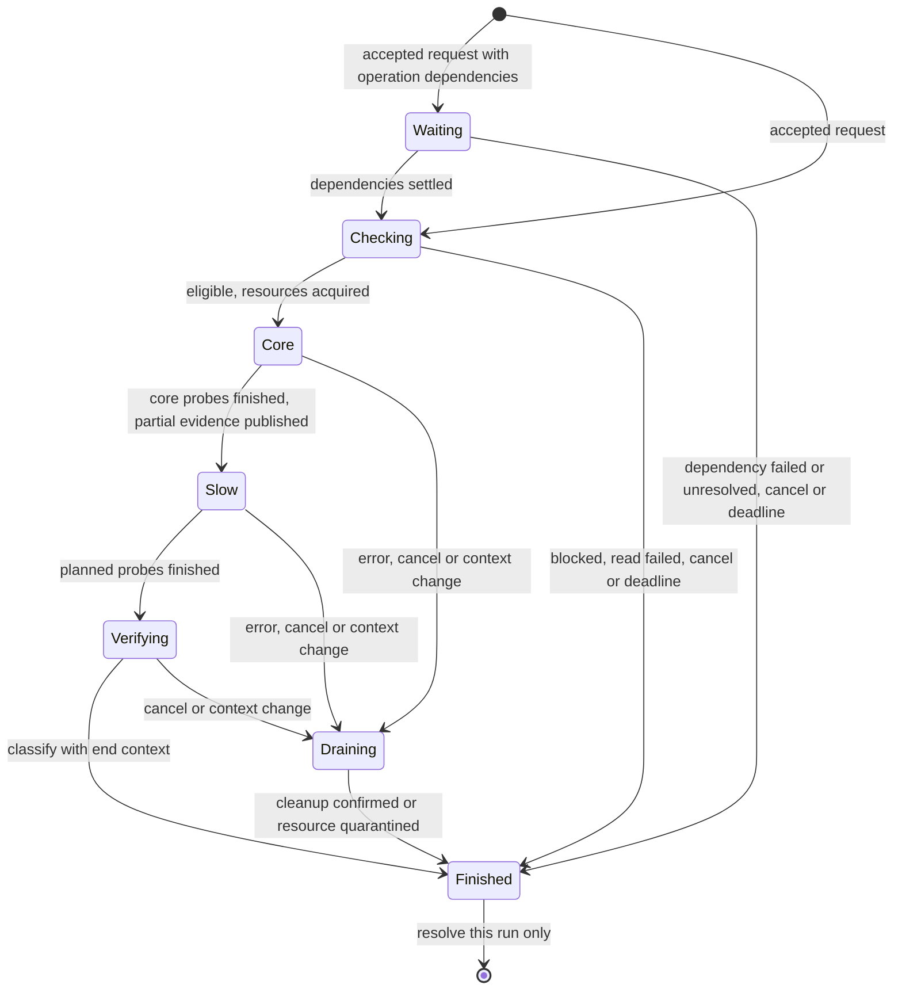

# App state: transition contract

Status: current specification of the process-owned state machines as implemented.
Configuration, observation and diagnostic-run coordinators are connected to the
app; config operations feed diagnostic admission and context; the screens, the
bridge and the bundle render one shared presentation; the Dashboard state is a
projection of that presentation; capture runs through the run coordinator but
keeps its older orchestration. Where the implementation deliberately deviates
from the design agreed on 2026-09-15, the deviation is recorded in place. The
stage-by-stage implementation log with its validation records is in
[app-state-transitions-history.md](app-state-transitions-history.md) (its
sections keep their original numbers, §13–§22). This contract extends
[app state design](app-state-design.md) and follows the
[diagnostics investigation](diagnostics-state-analysis.md). Runtime paths and
deadlines are documented in [storage](../storage.md),
[config coordinator](../config-coordinator.md),
[observation coordinator](../observation-coordinator.md) and
[diagnostics](../diagnostics.md).

Scope: process-owned config operations, drafts, observations, diagnostic runs,
measurement applicability, presentation and capture integration. Names below are
domain names, not a commitment to public Kotlin or JSON names, except where a
code identifier is quoted. Wire control-v2/telemetry-v1 remains unchanged.

## 1. Ownership and event ordering

Use related machines, each with one owner, rather than a screen-owned copy of each
state. Each machine is a pure reducer executed by its coordinator:

```text
reduce(previous, event) -> next + effects
```

Reducers do not suspend, read Android services, execute commands or format UI text.
Effects run outside the reducer and return identified completion events.

| Owner | State | Exclusive work |
|---|---|---|
| `ConfigCoordinator` behind `CanonicalConfigRepository` | Initialization, operation queue, confirmed config, phase outcomes | One mutating root operation, through activation/recovery |
| Draft registry and lifecycle state holders | Base identity, field patch, draft revision, submitted revision | Short edit/registration transitions; no lock held through I/O |
| `ObservationCoordinator` behind every `StateCache` facade | Last observation, request generation, active request, stale mark, error, quarantine | One physical load per resource; coalesce requests |
| `DiagnosticRunCoordinator` inside `DiagnosticDomain`, behind `DiagnosticsCache` | Request admission, active run, immutable run records, operation impact, the claimed confirmation key | One suite at a time, including export requests |
| Capture (`DebugExport`, `LogcatRecorder`) | Capture phase, logging token, evidence/errors | One forensic capture session; the §9 capture machine is designed, not implemented |
| Pure presentation functions | Eligibility, applicability, evidence summary, Situation, Dashboard assembly | No I/O and no independently mutable verdict |

Deviation from the original design, recorded deliberately: there is no global
event dispatcher and no single presentation revision published per logical
event. The coordinators publish immutable states independently;
`DiagnosticsCache.presentation` is a `combine` of the run view, the routing
observation, the root snapshot, the confirmed config, the operation impact, the
claimed confirmation key and the process inputs, mapped by the pure
`diagnosticPresentation`. Each emission is computed from one instant of all its
sources, which is the property the consumers need; ordering across coordinators
is "the app received it in this order".

`OperationId`, `RunId`, `CaptureId`, `RequestId`, `DraftId` are process-unique.
An effect also carries a step/attempt identity (`EffectTicket`). Accept its result
only if it is the expected outstanding effect. Duplicate events have no effect.
Obsolete observation results cannot publish. Late mutating-command evidence is
routed to recovery, never silently treated as a new operation or allowed to
overwrite a newer config.

An event means the app *received* evidence; coordinator order is not proof of the
order of independent external system changes. Unknown external ordering stays
unknown in the resulting observation.

Dependency direction is fixed: config effects never await dashboard derivation,
diagnostic completion or capture packaging. Diagnostics may await config effects;
capture may await both. Releasing a write lane schedules observation work but does
not await it. Shared helper/staging resources have explicit owners and separate
paths where concurrent use is necessary; do not solve collisions with a global
root lock that reintroduces this dependency cycle.

Universal rules for the transition tables below:

- An invalid user/API request returns a typed rejection and starts no effect.
- An irrelevant, duplicate or obsolete completion leaves state unchanged.
- Every accepted operation/run handle has its own result; do not await the next
  arbitrary terminal value in a global StateFlow.
- Collector/waiter disposal only detaches that consumer. Explicit cancellation is
  a different event and has the phase-specific rules below.
- No operation or run is resumed from an in-memory state after process death.
  Startup reconstructs observable facts. Accepted work has no survival guarantee.

## 2. Initialization and command admission

Config availability: `Uninitialized`, `Loading(request)`, `Available(config)`,
`Missing`, `Invalid(error)`, `Unavailable(error)`. Keep a last confirmed config
separately when a later read fails; it is historical, not a writable base.

| State / event | Next state and effects |
|---|---|
| Uninitialized / first demand | Loading; issue dedicated canonical read |
| Loading / valid read | Available; assign config revision; start allowed startup reconciliation |
| Loading / absent file | Missing; only explicit startup initialization/import may establish config |
| Loading / malformed or inaccessible | Invalid or Unavailable; show reason, no empty-default write |
| Missing, Invalid, Unavailable / retry read | Loading with new request identity |
| Not Available / ordinary mutation | Reject `config_unavailable`; preserve drafts |
| Startup reconciliation unresolved | Hold mutations as in section 3; reads remain possible |
| Self preparation not completed / request self-test | Terminal `NotStarted(initialization_pending)`; no inferred `selfNeedsRestart=false` |

Config availability alone does not open mutation admission. Startup also checks
whether previous app-owned root effects are quiescent. While that bounded check
runs, coordinator mode is Initializing. Proven quiescence permits explicit startup
initialization/reconciliation and then Open; uncertainty follows the same initial
readback plus one repeat, then Paused rule as an in-process timeout. A new app PID
does not prove an old privileged descendant stopped. The transport supplies
discoverable execution-lifetime evidence across app restarts through `vhmutate`
([root mutation transport](../root-mutation-transport.md)), or safely remains
paused; no full persistent operation journal or automatic command replay exists.
Commands issued by builds that predate the transport are untracked writers, like
module boot scripts: a lane never opened in this boot is adopted directly, and
their bounded, idempotent overlap with the first new-session command is an
accepted risk, not a reboot requirement (decided 2026-09-15).

The startup self-test intent (`DiagnosticsCache.run`) starts the first suite of
the process and afterwards only joins the active run or reads the latest attempt.
A suite blocked by a condition (VPN off, self excluded, restart pending) is a
terminal `NotStarted` attempt with that eligibility; nothing re-arms an intent
for it. Once the conditions become eligible, the measurement key of that world
is covered by nothing, and the owed confirmation of §7 requests exactly one
automatic suite. All these facts survive Activity recreation and reset on
process death.

## 3. Config operation machine

Coordinator mode: `Initializing`, `Open`, `Recovering(operation, attempt)`, or
`Paused(operation, uncertainty)`. A recovery cause may refer to previous-process
effects rather than an extant in-memory operation. Each accepted operation has:

```text
Queued -> Preparing -> Executing(step) -> Settled(result)
                           |
                           +-> Reconciling(0) -> Reconciling(1) -> Held
```

The immutable result records phases independently: canonical persistence, coupled
secret work and each backend activation. A phase is `NotAttempted`, `Running`,
`Confirmed`, `FailedKnown`, or `Unknown`. `FailedKnown` requires a known outcome;
a shell exit/timeout alone must not imply that the file remained unchanged.

The default effect plan preserves current prerequisites: read/validate current
config, canonical replacement, coupled secret commands if any, native activation,
then ports activation if required. Stop subsequent effect steps on failure. This
does not make the steps transactional; an earlier success remains successful.
Secret material stays inside effect execution, never in observable state/errors.

| From / event / guard | To | Effects and publication |
|---|---|---|
| Open / submit, valid command envelope | Queued | Allocate ID and immutable intent; immediately publish requested switch position/progress |
| Initializing / ordinary submit | Unchanged | Reject initialization_pending; startup bootstrap commands alone may run after predecessor quiescence is established |
| Queued / lane free | Preparing | Read fresh canonical config and required inventory; no whole-root scan solely for config |
| Preparing / read or validation fails | Settled(rejected) | No mutating effect; keep latest confirmed config and caller's draft |
| Preparing / candidate valid, bridge conflicts with registered draft | Settled(ui_edit_conflict) | Reject whole bridge command; no partial write |
| Preparing / candidate equal, no coupled work or explicit activation needed | Settled(no_change) | No write/activation; confirm against the fresh read |
| Preparing / validated candidate | Executing(persist) | Recheck drafts in the dispatch transition; reserve write lane; dispatch effect |
| Executing / canonical replacement confirmed | Executing(next step) or Settled | Publish confirmed config immediately; derive logger; continue prerequisite plan |
| Executing / known persistence failure before replacement | Settled(failed) | Remove pending intent; show latest confirmed position/error |
| Executing / known coupled/activation failure | Settled(partial_failure) | Keep confirmed config; report failed and unattempted phases; offer explicit recovery action |
| Executing / all required steps confirmed | Settled(command_completed) | Release lane; schedule affected observations outside it; no assertion of per-process consumption |
| Executing / outcome unknown | Reconciling(0) | Hold successors; read back phase evidence and transport termination evidence; never repeat mutation |
| Reconciling(0) / still unknown or check fails | Reconciling(1) | Exactly one automatic repeat of the read-only reconciliation check |
| Reconciling(1) / still unknown or check fails | Held; coordinator Paused | Resolve handle once as `unresolved`; show manual recheck; reject queued commands as `mutation_paused` |
| Either reconciliation / effects proven quiescent and phase outcomes known | Settled(reconciled result); Open | Publish actual readback, retain phase detail, release lane; do not auto-run missing effect steps |
| Paused / new mutation | Paused | Reject `mutation_paused`; do not accumulate hidden writes for later |
| Paused / manual recheck | Recovering(manual) | One read-only attempt, no automatic retry budget reset |
| Manual recovery / unknown | Paused | Update recovery evidence; retain same unresolved cause |
| Manual recovery / resolved | Open | Publish actual state and a separate recovery record; previously resolved handles stay immutable |
| Recovery check already active / another manual recheck | Unchanged | Join that read-only check; never launch duplicate recovery or replenish retry budget |
| Queued or Preparing / explicit cancel before mutating dispatch | Settled(cancelled) | Retire read request; no write |
| Executing or Reconciling / explicit cancel | Unchanged | Return `too_late_to_cancel`; finish/reconcile bounded effects |

Reconciliation attempt 0 is the initial readback, attempt 1 is its single automatic
repeat. A matching JSON is insufficient if an activator/descendant can still run.
Late acknowledgements may trigger a recovery decision only with sufficient evidence
that all effects have stopped. A late success line alone does not reopen the lane.
Recovery may consume a still-undispatched sequence in transport metadata: this
fences a root launch delayed beyond the app timeout and never repeats a config,
secret or activation effect; the "read-only" recovery policy excludes application
mutations while permitting this lifetime-metadata update.

After a known apply failure, a later ordinary command may proceed once effects are
quiescent. Retry activation is a new operation against **current** config, not a
replay of the failed command's old snapshot. After uncertainty resolves, queued
commands rejected during pause require resubmission, so recovery cannot unexpectedly
write old intent. Reads, navigation, drafts and unrelated DataStore settings remain
usable while mutations are paused.

Each accepted operation's lifecycle is published to a `ConfigOperationObserver`
synchronously from the coordinator's actor, in dispatch order: acceptance (before
any effect, with the operation's spec), preparation (the spec with the prepared
write set merged in: the diff of the transformed candidate against the fresh
base), every mutating root dispatch (phase), the single result delivery, and a
later manual recovery. Section 7 says what the diagnostic domain does with it.

## 4. Drafts and UI priority

A draft is a base config identity plus normalized field edits with per-field edit
revisions. Key overlap includes ancestors: deleting an app conflicts with any of
its edited fields; changing a role boolean conflicts with editing that role's hook
selection. UI edit publication and draft registration occur in the same event.

| Event | State change / operation result |
|---|---|
| Edit a field | Advance field/draft revision; register patch; immediate UI update |
| Observe a new config | Rebase untouched fields; keep edited fields and their revisions |
| Save | Snapshot submitted patch/revisions into a config operation; disable editing that draft during this save |
| Save persistence confirmed | Clear only fields whose current revision equals the submitted revision; rebase to confirmed config; retain operation's activation progress separately |
| Save fails before persistence | Keep patch; restore editing; report error |
| Save remains unresolved | Keep patch and unresolved operation link; allow local editing after handle resolves unresolved, but no new save until recovery |
| Recovery establishes submitted persistence | Clear only still-matching submitted fields; later edits survive; expose recovery outcome |
| Discard | Remove unsaved patch/registration; does not undo already dispatched persistence |
| Activity recreation | Reattach to same draft and operation IDs; do not unregister |
| Process death | Draft lost by design; next startup reads actual storage |

Editing is enabled again after persistence is confirmed; later edits are a new
draft revision even while the prior activation is still running. The same immediate
switch remains disabled until its operation settles or returns unresolved.

Bridge/UI ordering has two distinct cases:

1. A registered overlapping UI edit exists **before mutating dispatch**: reject
   the whole bridge command with `ui_edit_conflict`, application/field identifiers,
   and `persistence=not_attempted`.
2. A new overlapping UI edit arrives **after mutating dispatch but before bridge
   completion**: retain the draft and flag that bridge operation as superseded.
   Finish/reconcile its effects, then return `ui_edit_conflict` with actual phase
   outcomes (`confirmed`, `failed`, or `unknown`) and the current
   `ui_draft_pending` value (true unless that patch was subsequently discarded).
   Never claim no write occurred, and never auto-save the draft to fake rollback.

A bridge operation completed before an edit cannot retroactively fail. UI priority
means its unsaved values remain displayed/protected and its next save wins on those
fields; it does not mean unsubmitted edits are already installed in the backends.
The bridge error envelope carries structured phase results for this distinction.

Auto-hide reconciliation computes only allowed untouched-field changes and reports
skipped protected fields internally. Bridge mutations are all-or-reject before
dispatch. Whole-config import/reset overlapping any active draft returns a conflict
before dispatch; the UI can save/discard that draft, then explicitly retry. No
silent draft deletion or wildcard replacement over unsaved edits.

## 5. Observation machine

One immutable `ObservationState` contains `lastGood` (with its request and
finish time), `generation`, `active` request, `stale` mark, `error`, `attempted`
and the quarantine fields. `lastGood` carries the generation it was read at. A new
attempt never makes the old value new. Errors are structured and retryable.
`current` is the last good value only while it is not owed a re-read (no active
request, no error, no quarantine, same generation); `value` retains it as display
history regardless.

| Event / guard | Transition and effect |
|---|---|
| Ensure, no observation and no attempt | Start one load |
| Ensure, value/error/load already present | Reuse it; no retry loop from recomposition |
| Explicit equivalent refresh while loading | Join that request's handle |
| Invalidate due to a relevant event | Advance requested generation; retain lastGood; set the stale mark; start load if idle, otherwise request one successor |
| Success for active request at requested generation | Publish observation, clear the stale mark and finish its waiters |
| Success/error for older generation | Do not publish; finish old waiters with `superseded`; start one successor for latest generation |
| Error for current request | Publish Failed, keep lastGood historical; resolve waiters with error |
| Explicit retry after failure | New request identity; loading with previous value/error evidence retained |
| Waiter disappears | Detach waiter; process-owned load continues |

Joining is allowed only when the active request satisfies the caller's minimum
generation and collection-start time. A request for an observation made after a
modal opened or a command settled may need the coalesced successor instead. Its
handle follows that identified request; it cannot accept an older cached terminal
result. A physical-read timeout with unproven helper cleanup uses the resource
quarantine rules in section 7, rather than starting a competing successor.

The old physical read drains before its successor starts; cancellation is not proof
that blocking work stopped. Deadline failure is explicit, not endless loading. A
missing dependency produces `initialization_pending`, not a poisoned cache entry.

Every re-read states its cause. `ReadReason` is `Background` (our own process
invalidated it: a root dependency after a config phase or the startup reconcile,
the foreground-return safety net, the run coordinator's own gate reads),
`Transition` (an external signal that the observed fact may have changed: the
foreground app-VPN poller found a changed fact) or `Explicit` (the user asked).
The `StaleMark(reason, since)` is kept from the moment a re-read is owed until
the current generation publishes or fails; overlapping causes keep the earliest
`since` and the strongest reason, and the request that starts carries it.

Routing is the app-scoped VPN observation (`RoutingGateCache`): one privileged
helper reports this UID's state as `VpnOff`, `SelfExcluded` (excluded), `Routed`
or `Unknown(reason)`, with the framework VPN session identity and interfaces.
The foreground poller samples it silently once a second and requests a shared
refresh only for a changed or recoverable fact; negative states need two equal
samples 750 ms apart so tunnel setup cannot publish a false exclusion. Restart
requirements belong to process readiness, not network facts. The presentation
carries routing as knowledge, not as an admission decision:
`RoutingKnowledge.Known(fact, observedAt)`, `Verifying(lastKnown, reason, since)`
while a re-read is owed or running, or `Unknown(cause, lastKnown)` after a failed
or quarantined read. Derive diagnostic eligibility in this precedence:

1. Initialization incomplete -> `Initializing`.
2. Known restart/reboot requirement -> `RestartApp` / `RestartDevice`.
3. Relevant config effects unsettled/unknown/known failed -> `Applying` /
   `ApplicationUnknown` / `ApplicationFailed` until a later relevant operation
   succeeds or manual recovery resolves it.
4. Routing refresh outstanding or observation uncertain -> `Checking` / `Unknown`.
5. Known no VPN or excluded UID -> `VpnOff` / `SelfExcluded`.
6. Otherwise -> `Eligible`.

One consumer never converts `Unknown` into a positive/negative network fact. All
consumers use this same derivation, including capture guidance and bridge reads.

## 6. Measurement context and applicability

At admission, the Checking observation folds the current observations into the
`MeasurementContext` of the run: the subject (process and boot identity), this
UID's applied configuration (its roles and hook selection plus the global
optional features), the routing identity (the framework VPN session, the VPN
interfaces and this UID's routing verdict), the coverage (the active native
backend, its installed optional hooks and LSPosed liveness this boot, with the
typed layers retained beside the identity string), the `changeEpoch`, and the
root observation ID and time it was read at. Whole-config revision alone is not
this projection. The `MeasurementKey` is the context without its instant:
subject, configuration, routing, coverage and change epoch. Two contexts with the
same key describe the same measurable world.

`changeEpoch` is monotonic and advances at the first mutating dispatch of a
relevant config operation (§7). A known transition never disappears just because
values later match. There is no separate uncertainty epoch: a possible transition
not yet classified is exactly a routing observation that is not `Known`, and it
makes the measurement Unverified until a consistent reobservation restores it.
Undetected external changes remain a limitation, not an asserted guarantee.

| Event | Dependency / run effect |
|---|---|
| UI draft changes only | No applied-context change |
| Relevant mutating effect dispatched | Advance changeEpoch before side effects; interrupt the active run; readiness is Applying |
| Such a write later fails | Reobserve; do not resurrect the interrupted run as current |
| Debug-only or proven unrelated per-app edit, the startup runtime reconcile | No semantic invalidation; a forced activation without a write neither delays nor interrupts a suite |
| Imports, reset, shared UID change, unknown impact | Relevant |
| New routing identity (a re-established tunnel has a new framework network id), new coverage, new process | A new measurement key: the old measurement is Changed |
| Routing re-read in flight, failed or quarantined | Current applicability Unverified; never replace results with empty success |
| Statistics/UI preference change | No self-test invalidation |

"Unrelated app" requires different effective UID and no shared global capability
change. Relevance (`operationAffectsSelfMeasurement`) is decided from the declared
and then the prepared write set: this app's own roles and hook selection
(`apps/<self>/…` or the whole `apps` domain), global optional features
(`settings/optionalFeatures` or the whole `settings` domain), and whole
replacements (import, reset, removal). Relevance only ever increases within an
operation.

An immutable measurement has `RunId`, its start context, the frozen probe plan,
per-probe outcomes, whether it completed or was interrupted, its start and end
times and the end context. Raw observations gathered after a known interruption
are retained as evidence but never attributed as if collected in stable
conditions. Coverage of an old measurement is never recalculated using a new
backend: its report is built against its own retained layers.

Applicability is a pure projection (`measurementApplicability`), not a mutable
flag inside the measurement:

| Inputs, in precedence order | Applicability |
|---|---|
| No measurement | Absent |
| Measurement interrupted, or a known relevant change (epoch) since | Changed |
| No current context, or routing not Known | Unverified |
| Current key differs from the measurement's key | Changed |
| Same key | MatchesLastObservation |

`MatchesLastObservation` is deliberately bounded to observations; neither a TTL nor
an app revision proves continuous backend consumption. A failed observation alone
does not discard a prior measurement: successful reobservation restores
applicability if no known relevant change occurred. Interrupted measurements
cannot be restored this way. Execution/evidence sufficiency is checked separately.

## 7. Diagnostic execution machine

`DiagnosticRunCoordinator` executes `reduceDiagnosticRun` under one short lock
and runs its identified effects (`DiagnosticRunIo`: the context observation and
the phased probes) on the process scope. Keep `active`, optional `pending`, and
the retained immutable records (`lastAttempt`, `lastComplete`) separately. An
unsuccessful new attempt never deletes the last completed measurement; a result
referenced by neither is evicted. Every run is an immutable, identified attempt;
leaving a screen or recreating the Activity detaches a waiter and never cancels
or restarts a run.

States for an admitted request: `Waiting`, `Checking`, `Core`, `Slow`,
`Verifying`, `Draining`. Terminal outcomes (`RunOutcome`):

- `NotStarted` with no probes (blocked eligibility, a failed or unresolved
  operation dependency, a deadline, or explicit rejection).
- `Completed` including leaking or unmeasurable probes.
- `Interrupted` for cancellation or context change, with its evidence retained.
- `Failed` for execution failure, with partial evidence retained.



| From / event / guard | To and effects |
|---|---|
| No active run / request | Allocate ID and publish Waiting or Checking synchronously before returning the handle |
| Relevant config operation already accepted | Waiting(operation IDs) until those operations settle |
| Checking | Request the context observation: a not-invalidated routing observation is reused, an in-flight read is joined, only a stale, failed or absent one forces a new read |
| Waiting / required operations settle successfully | Checking; fresh context observation |
| Waiting / required operation fails or becomes unresolved | Finished(NotStarted) with that failure |
| Waiting / newly accepted relevant operation | Extend dependency set without extending the original deadline |
| Waiting or Checking / deadline expires | Finished(NotStarted, deadline exceeded) |
| Checking / blocked eligibility | `NotEligible`: Finished(NotStarted) recording the eligibility; no probe; a terminal attempt like any other |
| Checking / observation failed | Finished(Failed, read failed) |
| Checking / eligible | Capture start context and plan; Core |
| Core / core probes finished | Publish the partial evidence of this run; Slow |
| Slow / all planned probes finished | Verifying; observe the end context under the same freshness rule |
| Verifying / same measurement key | Finished(Completed); the measurement becomes `lastComplete` |
| Verifying / key changed | Finished(Interrupted, context changed); evidence retained, `lastComplete` unchanged |
| Core or Slow / a probe is unobservable | Record NotMeasured with its reason; continue the plan |
| Core or Slow / suite execution fails | Draining; stop new probes, await bounded cleanup, then Finished(Failed) |
| Core, Slow or Verifying / relevant change (first mutating dispatch of a relevant operation) | Draining(context changed); retain evidence; do not restart automatically |
| Waiting or Checking / explicit cancel | Finished(Interrupted, cancelled) |
| Core, Slow or Verifying / explicit cancel | Draining(cancelled); no successor until physical probe resources are released |
| Draining / cleanup confirms quiescence | Finished with the recorded reason; admit the pending request |
| Draining / deadline, quiescence not established | Finished with resource uncertainty; quarantine the probe resource; reject requests until the helper returns |
| Any / screen or one waiter closes | No execution transition |
| Finished / late stage response | Ignored; never turns old or incomplete evidence into a new run |

A suite starts in exactly three ways, and nothing else requests one:

1. **Startup intent.** `DiagnosticsCache.run` (`ensure`): the first suite of the
   process; afterwards it joins the active run or reads the latest attempt.
2. **Explicit re-check.** `retryDiagnosticsAndDashboard`, the one entry point of
   "the user asked to check again" (Retry on both screens, pull-to-refresh, the
   post-reset re-check): it refreshes the app-VPN observation, requests one
   explicit run and re-reads the Dashboard's root facts. An explicit request
   always allocates a new run after a completed one; it joins an active explicit
   run, and waits as the single pending successor of an active automatic run, so
   the click cannot be absorbed. No cache refresh requests a run as a side
   effect.
3. **Owed confirmation.** `owedConfirmation` reads the presentation: when this app
   is eligible and the current measurement key is covered by no presented
   measurement, no non-blocked attempt taken under that key and no key the owner
   already claimed, exactly one automatic run is owed for it. The presentation
   carries this as `confirmationPending`; the owner (`confirmMeasurements`) waits
   a 300 ms settle window restarted by every newer presentation, keeps at least
   5 s from its previous request, re-checks the latest presentation, requests
   the run and claims the key on admission. A failed run is answered by Retry,
   never by a loop. Because the rule reads state rather than transitions, a cold
   start already routed, a foreground return after a re-established tunnel and a
   session change seen by the poller take one path, and no edge can be lost to a
   missing baseline. A re-read that reveals no new key reruns nothing (I16).

Request admission while busy:

- An automatic request joins any active non-draining run with the same plan; an
  explicit request joins an active explicit run only. Return the actual shared
  RunId.
- Otherwise allow one pending request; a further one is rejected as busy rather
  than queued without bound. Request identity ignores dependencies: an active
  run already carries every accepted operation.
- A forensic request (`captureId` in its identity) cannot join any run: it waits
  as the pending run for the active one to settle.
- Cancelling an awaiter never cancels a shared run. Only `cancel` on the
  coordinator requests execution cancellation; a joined consumer can only detach.

Operation impacts reach the run through `DiagnosticImpactObserver` and the pure
`reduceDiagnosticImpact`: an accepted relevant operation is added to every new
request's dependencies and sent as `OperationAccepted`; its first mutating
dispatch advances `changeEpoch` and sends `ContextChanged`; its settlement sends
`OperationSettled(id, failure)`. Readiness for eligibility comes from the same
state (an unresolved relevant operation is `ApplicationUnknown`, an in-flight one
`Applying`, a known-failed one `ApplicationFailed`).

Waiting, checking, probing and cleanup all have finite deadlines. Waiting for an
operation that becomes paused finishes NotStarted, not an endless spinner. A
pending request retains its original deadline and is checked again on admission.

Probe resources have a separate lifecycle so a terminal handle never implies that
an uninterruptible helper vanished:

| Resource / event | Next state |
|---|---|
| Free / admitted effect | Busy(effect ticket); only that owner can release it |
| Busy / confirmed completion or cleanup | Free; admit next allowed effect |
| Busy / drain deadline without cleanup proof | Quarantined; resolve waiting requests with resource_unavailable |
| Quarantined / the late helper returns | Free; its late result is discarded; one queued request starts |
| Quarantined / any request | Rejected; the presentation names it (`probeUnavailable`) |

Quarantine affects that resource, not all app reads. External helpers can outlive
the app: startup establishes a safe helper session (versioned staging identity)
before launching probes, even though its in-memory quarantine was lost.
Restarting an Activity cannot clear quarantine.

Every check result carries a stable id: `NATIVE_CHECKS` for the Rust probes,
`NATIVE_EXTRA_CHECKS`, `CORE_JAVA_CHECKS` and `EXTRA_JAVA_CHECKS` for the
Java-implemented ones. The probe plan is derived from these registries at request
time and frozen; per-run outcomes are keyed by id. Ownership in the plan is
structural (Java-implemented native-level probes are unowned); backend-scoped
ownership of the Rust probes is applied by the report from the retained layers.

## 8. Evidence, presentation and Situation

Keep per-vector outcomes, owned/unowned scope and provenance. Native attribution
uses its root differential; Java attribution remains explicitly gate-based
inference. Preserve `NothingToLeak` and permission-blocked outcomes as distinct
from backend suppression.

Freeze the planned vector set at start; never drop unavailable probes from the
denominator to manufacture full coverage. A typed unsupported/not-applicable
reason may exclude a vector only through the probe plan, not a failed read.

For each layer expose counts for backend-hidden, system-blocked, nothing-to-leak,
leaking, not-measured and not-yet-run, plus uncovered observations separately.
Derive the owned-scope conclusion (`EvidenceConclusion`) in this precedence:

| Evidence | Conclusion |
|---|---|
| At least one owned leak observed | `OwnedLeak` |
| No attributable observation of hiding/leak (only nothing-to-leak or unavailable) | `Insufficient` |
| No owned leak, some hiding/blocking evidence, run incomplete or probes unmeasured | `Partial` |
| Complete plan, hiding/blocking evidence, no owned leak | `NoObservedLeak` |

This is not a replacement for module presence/readiness. A system-blocked vector
supports limited visibility, not that a module worked. Unowned leaks stay in a
neutral coverage section and do not inflate actionable issue counts. Findings
from an interrupted run remain observations with context warnings, not a fresh
backend verdict. Nothing here claims every selected app is protected.

**The presentation.** Every consumer renders one projection,
`DiagnosticPresentation`: the shared eligibility; routing as knowledge; the
active run (id, whether it is automatic, stage, partial evidence); the latest
attempt with its outcome, failure, measurement and blocking eligibility; the
latest complete measurement with its results, applicability and evidence
summary; `currentSuccess` (completed execution, sufficient evidence, an
applicable measurement and eligible conditions); `probeUnavailable`; the current
measurement key; and `confirmationPending`. Progress appears immediately and
never uses null as a synonym for loading. A failed latest attempt is visible even
if a previous complete measurement exists. A positive current claim requires
MatchesLastObservation; historical findings remain accessible without it.

**The Situation.** `situation(presentation, now)` classifies once, in one
precedence, into an exhaustive `Situation`: `Initializing`; `Checking(what,
lastKnown, reason, since)` with `what` = the VPN state, the suite or a
configuration change being applied; `VpnOff`; `NotMeasurable` (self excluded);
`ActionNeeded(RestartApp | RestartDevice | ApplicationFailed |
ApplicationUnknown)`; `CouldNotCheck(RoutingUnknown | RunFailed | Interrupted |
ProbeUnavailable)`; `Measured(evidence, staleness)` with staleness `Current`,
`Changed` or `Confirming(reason, since)`. Precedence: process health
(initialization, a quarantined probe) → the action the user owes → a
configuration change applying → routing knowledge → a run in flight → a pending
confirmation → the latest attempt → the measurement. A `Verifying` read is
`Checking` at once for `Explicit` and `Transition` causes and after a 2 s grace
for `Background` ones; inside that grace the last known fact stands and the
measurement is `Confirming`, which every surface renders exactly like `Current`.
An automatic confirmation of a still-applicable measurement is silent for the
length of the run; an explicit re-run, an automatic run after a change, and a
confirmation about to be requested are `Checking(Suite)`, so a stale measurement
is never worded as a result to re-check by hand while the owner is about to
replace it. A run that never started because of a condition is never a failed
check (I13). `DiagnosticsCache.situation` publishes one value per presentation
plus a single re-emission when a Background grace expires while the read is
still in flight; it words, it never schedules a run (I16).

**The surfaces.** The Dashboard hero and the Diagnostics banner are two wording
maps over the Situation (`heroVisual`, `diagnosticScreenDecision`); the tiles,
the issue counts, the results list and the attempt notice stay per-surface side
channels. The hero's colour is a function of the case: `Checking` is neutral with
a progress indicator and a subtitle naming what is checked, keeping the last
known condition's prompt with a busy button; `VpnOff` and `NotMeasurable` are
neutral; `ActionNeeded` and `CouldNotCheck` are Attention with the action or the
cause in the subtitle and the matching prompt; `Measured` takes the worst signal
of the tiles and the dashboard issues, and a changed or insufficient measurement
is at least Attention without ever softening a red one. The top-bar indicator
follows only `Explicit` derivations.

**The Dashboard state** is a projection, not a cache. `DashboardCache` caches
`DashboardRootFacts`, the half derived from the root snapshot alone (modules,
LSPosed, targets, environment, installed optional hooks, the legacy-import
prompt); `DashboardCache.state` combines those facts with the live presentation
and assembles the protection tiles (`protectionVerdict`: the latest complete
measurement rendered against its own retained layers is `Checked`; without one,
a latest attempt blocked by a gated eligibility is `Blocked`; everything else is
`Failed`), the banners and the screen state on every change of either
(`assembleDashboardState`, pure apart from wording). The tiles and the hero
therefore always describe the same instant. The state stays null until the root
facts exist and the suite has a first terminal attempt, so the Dashboard appears
with its first verdict.

**The bridge and the bundle** carry the same projection: `AgentControl.getState`
assembles the Dashboard state from the presentation once it reflects a terminal
attempt (`awaitTerminal`), overlays the current Situation on its tiles
(`overlayCondition`) so its legacy gate says "VPN off" whenever the hero does,
and reports the `diagnostics` summary (eligibility, active run, latest attempt,
measurement identity, applicability, evidence counts and conclusion,
`currentSuccess`, `probeUnavailable`, `lastKnownRouting`, `routingRead`) from the
same value; the legacy `gate`/`report` come from `reportGate` on that value. The
bundle does not carry the Situation itself.

## 9. Capture and API integration

Separate operations: read known state, refresh observations, request/await a check,
export a selected run, perform a fresh check with capture, record third-party logs.
Every export records which operation was requested and which RunId, if any, it
contains. `generatedAt` is payload assembly time; measurement times stay separate.

Implemented: the debug export does not measure on its own. `DiagnosticsCache.captureRun`
submits an explicit request carrying a unique `captureId`, which is part of the
request identity, so a capture can never join a suite whose probes began before
its logging and counter baseline; with a run active it is admitted as the pending
run and waits. Forensic order is: acquire the logging token, clear dmesg, then
run. The bundle reports the run's own outcome: only `Completed` may be `ROUTED`;
a blocked eligibility becomes its gate; an interrupted, failed, not-started or
never-admitted run contributes its partial evidence and an explicit reason
instead of a verdict. `exportDebug` returns `Written(file, errors)` or
`Failed(reason)`, so an export cannot be silently lost. Capture tokens belong to
captures, never composables; `effectiveDebug = debugSwitch OR tokens`; release is
idempotent and never restores an old whole-config snapshot. If mutations are
paused, cleanup cannot bypass the write barrier: `logging_restore_pending` is
recorded and recomputed at startup from persisted debug/debugSwitch after process
death, not from a lost token list. `getState(refresh=true)` remains an observation
refresh, not a hidden forced suite run.

Designed, not implemented (recorded so the remaining gap is explicit): the
capture machine

```text
Queued -> PreparingLogging -> Baseline -> Checking/Recording
       -> CollectingEvidence -> ReleasingLogging -> Packaging -> Finished
```

with its suite reservation between logging setup and baseline, its own deadlines
and its cancellation path through ReleasingLogging. Capture-logging acquire and
release keep their `finally` semantics and `LogcatRecorder` is unchanged. The
rules that machine must keep when it is built: all failure/cancel paths after
token acquisition pass through ReleasingLogging; a packaging deadline cannot
falsely mark cleanup complete; package only finalized files or bounded immutable
copies; a recorder whose termination is unproven is never represented as a
completed recording; failure to obtain root evidence never suppresses
already-collected app-side evidence; new measurement/attempt/eligibility meanings
require a bundle schema change and a bridge compatibility decision.

## 10. Invariants

| ID | Must always hold |
|---|---|
| I1 | At most one app mutation has uncompleted or unproven root side effects |
| I2 | Confirmed config is published only from confirmed persistence or identified readback, never from optimistic UI intent |
| I3 | Failed activation never rolls back confirmed config; unknown persistence never becomes a confirmed rollback |
| I4 | No stale observation overwrites a newer confirmed config or clears a newer error/loading state |
| I5 | Every accepted handle resolves at most once to its own operation/run; paused/quarantined outcomes are explicit |
| I6 | No shared work is cancelled because an Activity, collector or joined waiter disappears |
| I7 | An older save completion cannot erase a newer draft field revision |
| I8 | Pre-dispatch bridge conflicts write nothing; post-dispatch conflicts disclose actual effects |
| I9 | No probe suite overlaps another suite or reuses a quarantined probe resource |
| I10 | A completed measurement and its original coverage/context are immutable |
| I11 | Context changes/unknown observations cannot produce a fresh positive summary from old or mixed-context evidence |
| I12 | All-unmeasured or nothing-to-leak-only results cannot claim proven hiding |
| I13 | Gate failure, blocked eligibility, execution failure and detected leak remain distinct in UI/API/bundles |
| I14 | Capture release happens once logically; logging restoration is never falsely acknowledged |
| I15 | No secret enters state, diagnostic payloads, conflict fields or error text |
| I16 | Recomposition, timer ticks and observation refresh do not independently schedule completed-test reruns; a rerun is owed only by a measurement key nothing covers, once per key |
| I17 | Anything that must agree with the presentation (tiles, banners, the bridge's gate) is projected from it, never cached beside it |

## 11. Scenario traces for implementation tests

These are acceptance traces. The pure reducers are tested with explicit fake
effects (`ConfigOperationDataTest`, `ObservationDataTest`, `DraftDataTest`,
`DiagnosticRunDataTest`, `DiagnosticRunCoordinatorTest`, `MeasurementDataTest`,
`DiagnosticEligibilityDataTest`, `SituationDataTest`, `DashboardUiStateTest`,
`DiagnosticConfirmationDataTest`), and `DiagnosticDomainTest` drives the wired
diagnostic domain through its observation flows with a fake helper. Assert
intermediate publications and effect counts, not just final values.

| ID | Events | Required result / invariants |
|---|---|---|
| T1 | Two unrelated config commands submitted from one old screen snapshot | Both patches survive fresh execution reads; I1–I3 |
| T2 | Toggle -> JSON confirmed -> activation fails | Immediate requested position; confirmed position retained with apply error; I2–I3 |
| T3 | Timeout -> initial readback unknown -> automatic repeat unknown | Two read-only checks total; pause; queued handles rejected; no new writes; I1, I5 |
| T4 | T3 -> late success line without termination proof -> manual recovery | Stay paused until full proof; never duplicate write/activation; I1 |
| T5 | Root load A -> relevant invalidation -> A success -> load B failure | A cannot publish; B error plus lastGood historical; I4 |
| T6 | UI dirty field -> overlapping bridge command | ui_edit_conflict, no persistence; unrelated field command allowed; I8 |
| T7 | Bridge mutating dispatch -> UI edits same field -> root success | UI patch retained; bridge conflict includes confirmed persistence; I7–I8 |
| T8 | Save revision A -> unresolved -> edit B -> manual readback confirms A | Preserve B; historical handle unchanged; I5, I7 |
| T9 | Active run -> Activity recreated / bridge awaiter disconnects | Same RunId continues; no second suite; I6, I9 |
| T10 | Old NotStarted/Failed -> explicit retry | Synchronously allocate new request; waiter never receives old terminal result; I5 |
| T11 | Core complete -> slow phase error | Partial evidence retained; failed attempt visible alongside last complete measurement; I10, I13 |
| T12 | Complete run A -> VPN off -> VPN on with the same routing identity | A matches again; no rerun. With a new identity (a re-established tunnel): A is Changed, exactly one automatic confirmation, never "re-check needed" meanwhile; I11, I16 |
| T13 | Complete run -> root read error -> consistent successful reobservation, no known change | Unverified then MatchesLastObservation; dates preserved; I10–I11 |
| T14 | Core probes -> relevant save dispatched -> late probe response | Interrupted evidence; late response cannot certify new config; I10–I11 |
| T15 | Eligible -> network event between the two context reads | Interrupted; no fresh differential claim; I11 |
| T16 | Complete suite: all NotMeasured; then nothing-to-leak-only fixture | Insufficient evidence in UI, bridge and export; I12–I13 |
| T17 | Current gate unknown with old successful test | Explicit unknown everywhere; history visible; no endless spinner/current green; I11, I13 |
| T18 | Active normal run -> forensic request | Waits as the pending run; cannot join old probes; I9 |
| T19 | Capture -> user turns debug off -> capture ends twice | Effective logging kept during token; one release; restore current intent; I14 |
| T20 | Capture ends while mutation unresolved | Stop recording; release token; pending cleanup evidence; no barrier bypass; I1, I14 |
| T21 | Blocked self-test / failed root during support collection | Partial artifact when writable, explicit unavailable evidence, no fabricated verdict; I13 |
| T22 | Owned leak plus unowned leak; then only unowned leak | Actionable failure only for owned scope; uncovered observations remain visible; I12–I13 |
| T23 | Cancel running check -> helper cleanup times out -> request new check | Terminal interruption plus resource quarantine; no overlapping helper; I5, I9 |
| T24 | Explicit check waits on save -> save becomes Paused | NotStarted(application_unknown); no indefinite waiter; I5 |
| T25 | Boot changes / app process dies during operation or capture | No claimed continuation; fresh initialization/reconciliation, no inherited draft; I1–I3, I14 |
| T26 | Whole import/reset with open draft; then discard and resubmit | First rejection has no effect; second uses fresh config; I7–I8 |
| T27 | Debug or distinct-UID target edit, or the startup reconcile, with unchanged self projection | No new suite and no false semantic change; I16 |
| T28 | UI render and agent snapshot from same presentation value | Identical eligibility, selected RunId, applicability and findings; I13, I17 |
| T29 | Canonical remember setting persists -> secret command fails or times out | Explicit independent phases/repair; no secret in logs, state or bundle; I1–I3, I15 |
| T30 | Capture reserves suite -> logging command waits on config lane | Config completion does not wait for suite/dashboard; bounded capture outcome, no cycle; I1, I5, I9 |
| T31 | Foreground return while the resume re-read is in flight, then a re-established tunnel | Nothing owed while routing is Verifying; one confirmation for the new key once Known; the same key read again reruns nothing; I16 |
| T32 | A run finishes while the Dashboard state was derived earlier | The tiles follow the presentation on the same emission; no attempt-id bookkeeping; I17 |

## 12. Validation boundary

Pure reducer tests prove decisions for supplied events; they cannot prove the
adapters report reality. Run the Kotlin tests, ktlint, detekt, CPD and Android
lint for code changes, then validate on devices what only devices show: root
timeouts and late effects, real VPN transitions (off/on, split-tunnel membership
changes, a re-established tunnel while the app is backgrounded), Activity
recreation during a run, process restarts and capture cleanup. Device records
are kept in [vpn-poll-device-validation.md](vpn-poll-device-validation.md) and
the pull requests that shipped each stage.

Known gaps, deliberately open:

- The §9 capture machine (reservation, its own states, deadlines and
  cancellation path).
- No single presentation revision across all coordinators (§1 deviation); the
  diagnostic presentation is one instant of its own sources.
- The startup runtime reconcile invalidates every root observation because the
  activator does not report whether a forced activation changed anything; the
  Background grace keeps that re-read silent. A targeted invalidation of
  runtime-only sections is the cheaper follow-up if the background work matters.
