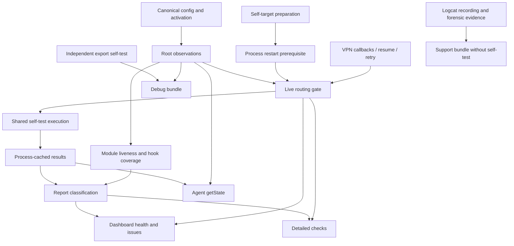
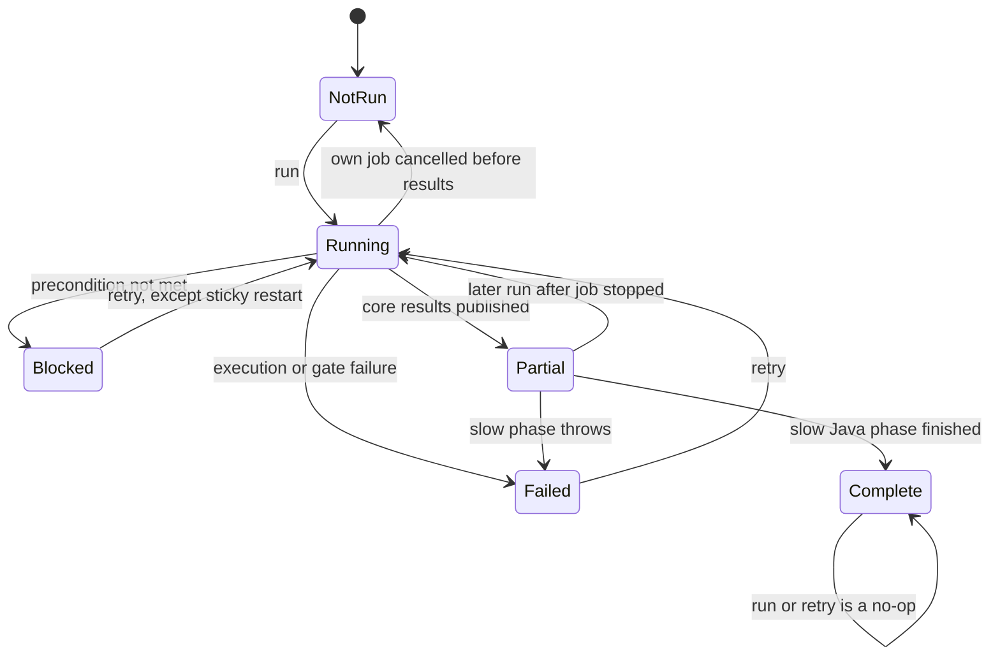

# Diagnostics: meaning, state and history

Status: source and history analysis, with design questions. No runtime change or
new freshness/rerun policy is approved by this document.

The subsequent [transition contract](app-state-transitions.md) specifies the new
design direction. This analysis remains a record of the baseline behavior and
questions that motivated it; its open questions are historical inputs to that
contract, not competing runtime rules. The code it describes (the
`DiagnosticsCache.State` projection, caller-scoped runs, `retry` aliasing `run`)
has since been replaced; read the contract §18–§21 for what runs today.

Baseline: `3818954e1615697427664a6bbcff6d9d6483f0c4`, inspected on 2026-09-15 in
`../vpnhide_state`. Complements [diagnostics](../diagnostics.md),
[debug bundles](../debug-bundle.md) and the [app state proposal](app-state-design.md).
Claims about reachable behavior below come from source inspection, not a new
device reproduction. Historical device results in commit messages are historical
evidence, not validation of this checkout.

## 1. What “diagnostics” currently means

The [Kotlin glossary](../../lsposed/AGENTS.md) already identifies seven uses. They
answer different questions and have different lifetimes:

| Meaning | Concrete owner / data | What it can answer |
|---|---|---|
| Self-test suite | `runCoreChecks`, `runExtraJavaChecks`, native `vhprobe` | What VPN artifacts this app process observed on specified surfaces during the run |
| Execution lifecycle | `DiagnosticsCache.State` | Whether a shared run started, was blocked, failed, has partial results, or finished |
| Classified report | `CheckOutcome`, `DiagnosticReport`, `LayerStatus` | How those observations are attributed and counted against backend coverage |
| Self-test precondition | `DiagnosticGate`, `RoutingGateCache` | Whether a user VPN is observed, this UID is routed through it, and this process is eligible to test |
| Implementation troubleshooting | `HookDiagnostics`, `ConnectivityAttachDiagnostics`, `KpmDiagnostics` | Whether installation, hook attachment, runtime access or a specific backend failed |
| Support capture | `DebugExport`, `LogcatRecorder`, `VpnHideState` | Evidence collected for a particular support session; it may contain a self-test or no self-test |
| Raw probe diagnostics | `app_scan_diagnostics`, `kmod_diag` sections | Problems collecting inventory or inspecting the kernel backend; not self-test verdicts |

Additional states interact with these, but are not interchangeable:

- **Desired config** says which apps/features the user requested. A successful
  config save is not a measured hiding result.
- **Activation result** says a command completed; it does not acknowledge that
  every already-running process consumed the config.
- **Module observations** describe installed/enabled/loaded/observable modules.
  An active module can still leak; unreadable runtime state is not inactive.
- **Statistics** are sampled counters. A matching positive delta is useful hook
  execution evidence; a zero does not prove the hook is broken. Self-test outcome
  classification does not consume these deltas. Forensic hook reports can.
- **Dashboard health** combines setup/environment issues and self-test summaries.
  Its “Protected” label is broader than the evidence supplied by one self-test.

### Subject and limits of a measurement

The suite probes VPN Hide's own process/UID. It does not execute inside each
selected third-party app. It does not establish complete app-hiding effectiveness,
localhost-port blocking, every destination's route, or every possible VPN detection
surface. A third-party logcat recording is not a measurement of that app's hiding
success merely because the recorder app passed its self-test.

Native checks run the same probe implementation in-process and through root,
sequentially. Root is intended to be outside the hiding targets. Comparing the two
views is stronger evidence than a clean app result alone, but it assumes a
sufficiently stable environment between samples. The report does not currently
record enough context to verify that assumption after the fact.

Java framework checks have no equivalent root differential. Their
`HiddenByBackend` is inferred from a clean observation under the self-in-tunnel
precondition. Routing is a necessary premise in the current design; it does not
independently prove that every API would expose an artifact without a hook.
Unobservable APIs and callback timeouts must remain distinct from clean results.
The Java-implemented native-level `NetworkInterface` enumeration also lacks a root
differential and is classified as an unowned native surface.

## 2. Current pipeline and dependencies

This diagram shows dependencies, not an atomic snapshot or guaranteed scheduling
order. In particular:

- Startup prepares self targets, then seeds dashboard/routing/check caches. A
  sticky `restartPending` in `DiagnosticsCache` depends on startup providing the
  correct prerequisite before execution. This should become an explicit input
  contract, not an inferred false when initialization is incomplete.
- `DiagnosticsCache` refreshes the routing gate before its probes. It does not
  revalidate that gate after the slow phase.
- A config commit refreshes initialized derived caches, including routing and
  dashboard, but deliberately excludes `DiagnosticsCache`.
- `DashboardData.resolveProtectionFacts` awaits complete shared results, combines
  them with module observations, and derives issues. Detailed diagnostics combines
  cached results with ownership from `DashboardCache` separately.
- `DashboardIssues.protectionIssues` consumes owned leak counts and uses report
  coverage to assess partial hook-install gaps. Installation/version/environment
  issues have additional independent inputs.
- Diagnostic success is not a prerequisite for ordinary config editing or native
  activation. Capture logging does mutate config, so a forensic collection can
  itself cause activation and cache refreshes.

The useful architectural boundary is between observations, execution, interpretation
and presentation. Putting all four into a larger mutable “diagnostics state” would
not resolve their different meanings.

## 3. Existing state transitions

### Shared self-test execution

`Partial` and `Complete` above are both `Ready(results, complete)` in code.
Important qualifications:

- “Complete” means the suite finished, **not** that all checks were measurable or
  all passed. A completed run containing leaks is also frozen until process death.
- `Blocked` carries `VPN_OFF`, `SELF_NOT_ROUTED` or `NEEDS_RESTART`.
  `restartPending` is sticky; a subsequent caller's false does not clear it.
- Cancellation after partial publication retains those partial results; it does
  not make them complete. Ordinary failure replaces partial state with `Failed`.
- Runs use the initiating caller's scope. `awaitTerminal` supplies a process
  scope, but does not adopt an already-running job started by a screen scope.
- `Failed` carries no structured error details or run identity.
- `retry()` aliases `run()`. It is not an instruction to repeat a completed test.

### Live precondition

`DiagnosticGate` has four values: `VPN_OFF`, `SELF_NOT_ROUTED`, `NEEDS_RESTART`,
`ROUTED`. Loading and failure live outside that enum in `StateCache` flows.

Current root interpretation distinguishes Android VPN networks from carrier
IMS/IWLAN interfaces. Root-managed tunnels also need interface/route evidence.
Self-routing uses UID policy rules and, where needed, sampled route lookups; it
does not prove routing for all destinations and marks.

`RoutingGateCache` refreshes on manual requests, config refresh, VPN callbacks
(750 ms debounce), and foreground return (4-second throttle). Callbacks are
triggers, not truth: they can be missed, filtered, or absent for root-managed
tunnels. This is refreshed observation, not continuous certainty.

An inconclusive probe now invalidates the old gate and exposes an error. The
distinction between null/loading and null/failed is therefore essential. The pure
`resolveDiagnosticGate` helper still treats `selfRouted=null` as routed; the current
`captureGateFrom` call chain rejects unknown routing before reaching that helper.
Do not reuse the helper alone as an unknown-safe classifier.

### Measurement outcome versus verdict

| Layer | Existing rule | Meaning and limitation |
|---|---|---|
| Native check | App leak wins; otherwise root/app differential | `HiddenByBackend`, `HiddenBySelinux`, `NothingToLeak`, or `NotMeasured`; these must not collapse into identical backend successes |
| Java check | Clean / leaking / unobservable | Backend attribution uses the gate premise, without a per-API root control |
| Native module | Presence first; then owned hidden/leak counts | Unowned leaks do not lower its verdict |
| Java module | LSPosed active flag, then Java counts | Inactive if LSPosed is not active; all Java checks belong to this summary |
| Active layer verdict | Zero leaks = `Ok`; hidden plus leaks = `Partial`; leaks without hidden = `Broken` | Zero leaks also covers zero measured checks; no minimum evidence threshold |
| Report verdict | Available only if gate is `ROUTED` | Does not check `complete` or measured coverage |
| Dashboard hero | Gate, layer status, errors and warnings | Setup-health policy; not an all-app/all-vector guarantee |

`NothingToLeak` means root found no artifact on that surface. It is useful evidence
about the observation, not proof that the backend hid anything. “SELinux” is the
classifier's attribution for permission-blocked access, not a separate audit of
which security policy caused every denial.

## 4. Consumers do not currently share one measurement snapshot

| Consumer | Probe results | Gate / module inputs | Refresh meaning |
|---|---|---|---|
| Detailed diagnostics | Shared cache, including partial results | Live gate; ownership from dashboard cache | Retry gate and unfinished/failed run; completed results reused |
| Dashboard screen | Complete shared result folded by loader | Cached module/issues; live gate overlaid in Compose | Root/module reload plus retry; complete probes still reused |
| Agent `getState(refresh=true)` | Complete shared result | Root reload; gate inferred from cached terminal state | Does not force a new completed self-test or apply the UI's live-gate overlay |
| Debug export, including lean export | Fresh direct `runAllChecks` | Root snapshot and gate collected after checks | Independent run; does not update `DiagnosticsCache` |
| Full logcat recording | No self-test | Runtime/forensic context around recording | Bundles logs; passes null gate/results to state builder |

`DiagnosticReport` gives common classification rules. It is built multiple times
with different inputs; it is not one stored report rendered everywhere.
`VpnHideState.generatedAt` dates assembly of the payload, not the age of every
measurement inside it. The agent can therefore return newly generated JSON with
old tests, and an export can legitimately contain different results from the UI.

Forensic export additionally enables capture logging, records counters, clears
the dmesg window and collects logs. A lean export still runs the probes but skips
that forensic setup. These are operations with their own progress/cleanup/errors,
not simple serialization of screen state.

The self-routing warning is about the recorder app. Its failure can explain an
incomplete self-test, but does not make all third-party logcat, installation or
boot evidence useless. The existing “collect anyway” escape hatch is valuable.

## 5. Concrete gaps and their consequences

These are source-level findings. Device reproduction and deterministic execution
tests remain to be added when implementing fixes.

1. **Gate failure has inconsistent UI meanings.** `RoutingGateCache.load` clears
   the gate on an inconclusive probe. Detailed diagnostics tests `liveGate == null`
   first and shows a spinner without observing the error. Dashboard falls back to
   its cached `ProtectionCheck` when the gate is null and can retain a previous
   positive status. `rememberCaptureGate` also drops the error dimension: after
   refresh ends with null, the export can offer normal collection without a gate
   warning. The logcat Start button does not wait for `rechecking` even normally.
   These failures need an explicit presentation contract, independently of reruns.

2. **A live gate can make an old measurement look current.** Run under VPN A,
   disconnect, change routing/config, then reconnect under VPN B: gate banners
   update, but `Ready(complete=true)` is reused. Both gates being `ROUTED` does not
   establish equal measurement conditions. Config changes have the same issue;
   fixed hook installation does not imply fixed hook inputs or network state.

3. **Read APIs discard distinctions.** For a blocked shared run, Agent `getState`
   computes a gate but has null results. `buildVpnHideState` creates no report and
   assigns `gate = report?.gate`, losing the top-level blocked reason. The nested
   dashboard may still carry it. For a failed run, report/gate are also null and
   the caller supplies an empty errors list. Neither null means simply “no tests
   requested” in all capture kinds. `selfNeedsRestart=false` in the agent payload
   can also disagree with the cache's sticky restart prerequisite.

4. **Retry waiting is not tied to the requested run.** `run()` schedules the job;
   `Running` is published later inside `doRun`. From an old `Blocked`/`Failed`,
   `awaitTerminal` can read that old terminal state before the newly scheduled
   job runs. A waiter can also remain waiting after a screen-owned run is cancelled
   into `NotRun` or incomplete `Ready`, until another caller launches a run.
   Define run identity and ownership before exposing “rerun and await fresh”.

5. **“No observed leak” can become “OK” without measurements.** With an active
   layer, all relevant outcomes `NotMeasured` still produce `Active(0, 0)` and
   `Ok`. Even `ROUTED` plus null/empty results is accepted by the report builder.
   Current complete-result callers reduce the empty-input risk, but do not solve
   all-unmeasured outcomes. The detailed screen also shows `banner_ready` during
   incomplete `Ready`. Execution completion, measurable coverage and health need
   separate meanings; the exact positive-verdict threshold is a product decision.

6. **Capture failure can lose the artifact intended to explain it.** Export runs
   checks before its final gate. Unknown routing at that point throws; the outer
   exporter returns null rather than a bundle containing the failure evidence.
   A successful final gate would not prove conditions held throughout the earlier
   probes either. Decide how partial evidence and collection failure are represented.

7. **Some documentation promises more than the code establishes.** Comments in
   `DiagnosticReport`, `VpnHideState` and `DashboardData` claim identical UI/export
   snapshots. Comments in `LayerStatus` still say unowned leaks raise hero warnings,
   although the August policy removed them. `DiagnosticsCache` says results cannot
   change mid-process. Preserve the useful behavior, but correct these claims when
   changing the corresponding contracts. Java/native-extra report IDs are empty,
   and native IDs are attached by positional zip: future per-check comparison
   requires stable identities rather than localized labels.

The helper `protectionScore` counts all measured non-leaks, including
`NothingToLeak`, as passed. It currently has no production call sites found in the
Kotlin tree; it is not evidence that the dashboard uses a pass percentage.

## 6. How the model accumulated these meanings

Dates below use repository author dates. Commit links refer to changes present in
the baseline ancestry; the July redesign is cited by its integrated squash commit
rather than counting its development commits as additional changes.

| Date / commit | Problem addressed and resulting change | Consequence still relevant |
|---|---|---|
| Apr 13, [567b377d](https://github.com/okhsunrog/vpnhide/commit/567b377d) | Merge diagnostic probes into the app | Measurement subject becomes the same app/process whose configuration and UI are managed |
| Apr 15–18, [f67cb409](https://github.com/okhsunrog/vpnhide/commit/f67cb409), [b21df83d](https://github.com/okhsunrog/vpnhide/commit/b21df83d) | Add debug toggle/export, then temporary capture logging | “Diagnostics” includes a state-changing evidence-collection workflow |
| Apr 20, [c5d96546](https://github.com/okhsunrog/vpnhide/commit/c5d96546) | Cache checks for process lifetime; preserve capture tools when VPN is off | Fast tab changes are a real requirement; process-long validity was an assumption based on hook lifetime |
| Jun 23, [f7aa683b](https://github.com/okhsunrog/vpnhide/commit/f7aa683b) | Stop duplicate dashboard/check execution; publish core then slow phase | Shared execution and progressive results; dashboard initially awaited only core |
| Jun 29, [9e42e46e](https://github.com/okhsunrog/vpnhide/commit/9e42e46e) | Move diagnostics to Settings and make dashboard summary use full checks | The slow phase becomes a dependency of the top-level health verdict |
| Jun 30, [c261eb05](https://github.com/okhsunrog/vpnhide/commit/c261eb05), [345996cc](https://github.com/okhsunrog/vpnhide/commit/345996cc) | Separate execution failure from VPN-off; repair cancelled-run state races | Error and cancellation are distinct from measurement results; do not regress into one null state |
| Jul 4, [dde3a58a](https://github.com/okhsunrog/vpnhide/commit/dde3a58a) | Root differential, outcome taxonomy, backend ownership, self-routing gate, Java attribution | Replace pass-count claims with evidence and scope; keep unobservable and nothing-to-leak distinct |
| Aug 11, [daeb3a71](https://github.com/okhsunrog/vpnhide/commit/daeb3a71), [cffc4374](https://github.com/okhsunrog/vpnhide/commit/cffc4374) | Canonical report model; cache owns gate/restart precedence | Shared classifier fixes semantic drift; not yet a shared observation identity |
| Aug 14, [ecc99482](https://github.com/okhsunrog/vpnhide/commit/ecc99482), [fa33f5c7](https://github.com/okhsunrog/vpnhide/commit/fa33f5c7) | Callback timeout/enumeration exception become unmeasured; verdict access is gate-checked | Positive claims need evidence; `ROUTED` alone still does not establish measured coverage |
| Aug 15, [e2a66ecd](https://github.com/okhsunrog/vpnhide/commit/e2a66ecd) | Uncoverable vectors become neutral, outside issue count | Dashboard intentionally measures actionable backend health, not absence of every detection route |
| Aug 19, [9d56892d](https://github.com/okhsunrog/vpnhide/commit/9d56892d), [4b54381b](https://github.com/okhsunrog/vpnhide/commit/4b54381b) | Serializable domain and one state payload for file/agent reads | Common schema reduces translation errors; different collection paths still have different ages and gates |
| Aug 20, [98ed02e1](https://github.com/okhsunrog/vpnhide/commit/98ed02e1) | Shared live gate, VPN/resume triggers and capture warnings | Explicitly preserves process-scoped results; now live preconditions overlay historical measurements |
| Aug 25, [50f53506](https://github.com/okhsunrog/vpnhide/commit/50f53506) | Document seven diagnostic meanings | Naming ambiguity was recognized; ownership/meaning still needs to reach the API contract |
| Sep 14, [0bfd702d](https://github.com/okhsunrog/vpnhide/commit/0bfd702d) | Exclude carrier tunnels, support root tunnels, stop treating unknown routing as certainty | Better evidence model introduces failed/null gate paths the UI has not fully incorporated |

This is not a story of one bad cache choice. Each change addressed a concrete
problem: duplicate work, misleading green checks, inconsistent screens, noisy
warnings or stale routing. The remaining gap is a common definition of **which
observation, of what subject, under which conditions, supports which claim now**.

## 7. Questions the next design must answer

The user-facing questions below are inferred from the existing workflows, not
validated user research:

| User question | Necessary evidence / action |
|---|---|
| Is my setup usable? | Module installation/liveness, config application and actionable setup problems |
| Did hiding work in the test? | Dated self-process measurements, attribution, coverage and limitations |
| Does that result apply after my change? | Original measurement context compared with current observations; uncertainty visible |
| Why does a particular app still detect VPN? | That app's role/process lifecycle, relevant uncovered surfaces and reproduction evidence |
| What can I send for troubleshooting? | Capture type, partial failures, relevant logs and a reproducible context even when self-tests cannot run |

Recommended design boundaries, pending a separate decision:

1. Keep **execution** (`idle/running/partial/completed/failed/cancelled`) separate
   from **precondition observation**, **evidence sufficiency**, and **applicability
   of an older run**. These are independent dimensions; a completed failed-hiding
   measurement is not an execution failure.
2. Preserve the original evidence when current conditions change. Decide whether
   to hide, label, or retain its summary separately from deciding to schedule tests.
   Avoid clearing evidence merely because a current observation failed.
3. Define a run identity, subject, collection interval and relevant input evidence
   before choosing freshness keys. Saved-config identity and observed runtime
   identity are different; a fingerprint cannot prove backend consumption.
4. Define explicit actions: refresh runtime observations, check eligibility, repeat
   the self-test, and collect support evidence. One ambiguous Refresh should not
   silently mean different actions to UI and bridge callers.
5. Preserve the current useful classifier and coverage registry. Testable execution
   ownership and common presentation derivation can extend existing abstractions;
   neither requires replacing all state management with a new framework.

Policy decisions that remain open:

- What exactly should a positive hero/“OK” promise when tests are incomplete,
  unmeasured, SELinux-blocked, or show uncovered leaks? Retain the intentional
  August neutral-coverage policy unless explicitly reconsidered.
- Which changes affect the self-test subject? Another app's target edit is not
  automatically equivalent to changing VPN Hide's hooks. Debug-only changes affect
  capture setup; this does not automatically make them self-test invalidators.
- Is an old measurement still applicable after VPN off/on, tunnel replacement,
  route changes without a callback, hook changes, or lost root access? Distinguish
  known mismatch from inability to verify. Do not use an arbitrary TTL as proof.
- When is explicit rerun sufficient, and when should the app offer or schedule
  one? How are repeated requests coalesced and in-flight context changes handled?
- Which situations require app restart versus device reboot, and which inputs
  establish that requirement? A rerun in the same process cannot install missing
  specialization-time hooks.
- Should export capture exactly the selected historical run or deliberately make
  a new one? What does `getState(refresh=true)` promise? Define compatibility and
  bundle/bridge schema changes before implementation.
- How do captures describe failed eligibility checks and partial evidence without
  preventing users from collecting the material needed to diagnose those failures?

## 8. Acceptance work before changing behavior

Existing tests cover classification, layer rollup, report gates, VPN presence,
module detection and serialization. They do not establish the coroutine or
cross-consumer timelines above. No runtime tests were executed for this docs-only
analysis.

The diagnostic design needs deterministic scenarios for:

- Old blocked/failed state followed by retry: waiter receives the requested run.
- Activity disposal/recreation during core/slow probes; no lost execution owner,
  stranded waiter, or late publication from an obsolete run.
- Gate becomes unknown, VPN-off or excluded before/during/after a completed run:
  dashboard, detail, bridge and export preserve the same distinctions.
- All checks unmeasured; mixed `NothingToLeak`/SELinux/backend/leak results;
  partial completion with a later leaking slow probe.
- Relevant config changes during measurement/activation; module ownership changes
  after an old result; unrelated target and debug changes.
- Export alongside shared probes, manual gate rechecks and capture logging;
  collection failure still has an explicit outcome and logging cleanup.
- Every capture kind serializes blocked, failed, absent, partial and historical
  measurement states unambiguously, with schema fixtures where needed.

Device validation must then exercise real VPN transitions, root denial/timeouts,
split tunneling, root-managed tunnels, Activity recreation and process restarts.
Include backend/device identity and timings. Historical successful runs and unit
tests alone cannot establish these behaviors on the current app.

## Source map

Paths relative to `lsposed/app/src/main/kotlin/dev/okhsunrog/vpnhide/`:

- Execution/gate: `diagnostics/DiagnosticsCache.kt`,
  `diagnostics/RoutingGateCache.kt`, `diagnostics/VpnTransportWatcher.kt`,
  `diagnostics/GroundTruthProbe.kt`, `VpnPresenceData.kt`, `StateCache.kt`.
- Measurement/interpretation: `diagnostics/JavaChecks.kt`,
  `diagnostics/NativeChecks.kt`, `checks/NativeProbe.kt`,
  `diagnostics/CheckOutcome.kt`, `diagnostics/LayerStatus.kt`,
  `diagnostics/DiagnosticReport.kt`, `HookRegistry.kt`.
- Consumers: `diagnostics/DiagnosticsScreen.kt`, `DashboardScreen.kt`,
  `DashboardData.kt`, `DashboardIssues.kt`, `NativeBackendData.kt`, `AgentControl.kt`.
- Capture: `debug/DebugExport.kt`, `debug/LogcatRecorder.kt`,
  `debug/VpnHideState.kt`, `debug/DebugCaptureLogging.kt`,
  `diagnostics/HookDiagnostics.kt`.
- Integration: `startup/StartupCoordinator.kt`, `startup/MainActivity.kt`,
  `CanonicalConfigRepository.kt`, `RootSnapshotCache.kt`.

Native probes: `lsposed/native/src/lib.rs`, `lsposed/native/src/bin/vhprobe.rs`.
Tests: `lsposed/app/src/test/kotlin/dev/okhsunrog/vpnhide/`, especially
`ClassifyNativeOutcomeTest`, `ClassifyJavaOutcomeTest`, `LayerStatusTest`,
`DiagnosticReportTest`, `VpnPresenceDataTest`, `VpnHideStateTest` and
`BundleSchemaGoldenTest`.
